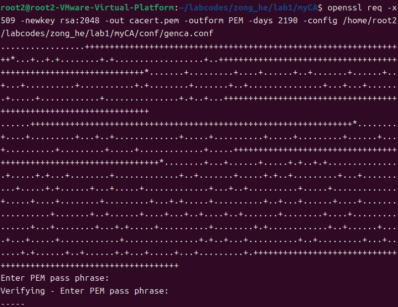
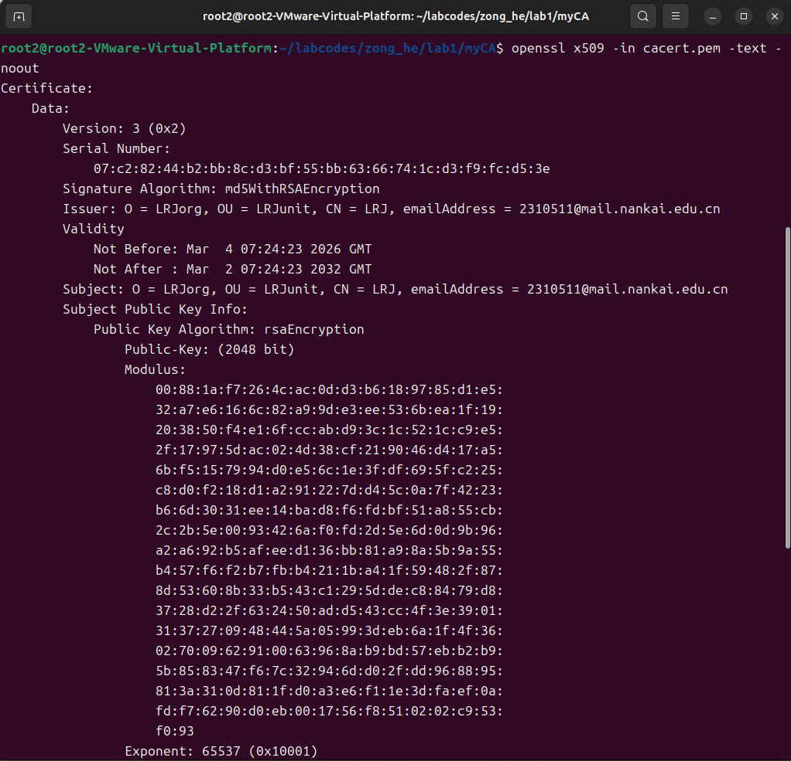
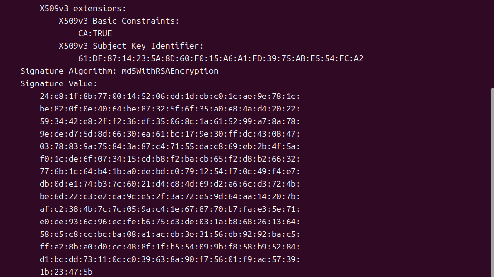
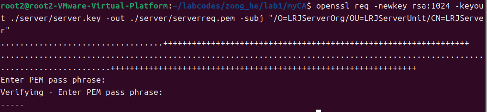
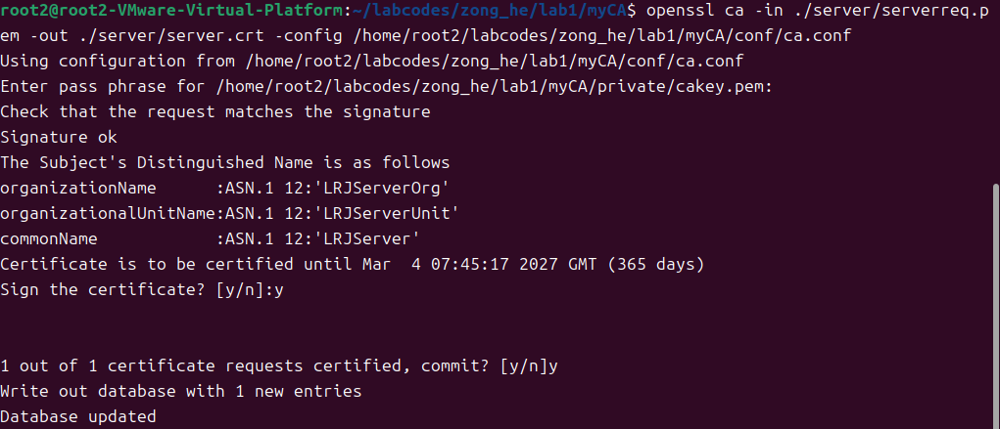
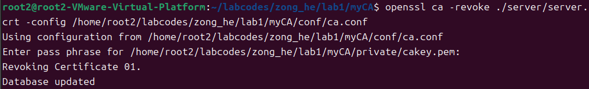
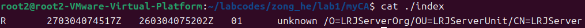
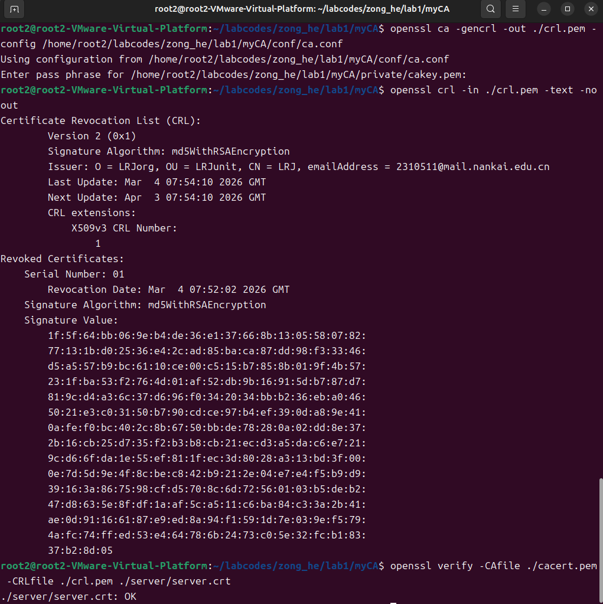

# 信息安全综合实验报告 - 实验1：私有CA证书签发的简单实现

## 一、 实验目的

1.  **深入理解 PKI 体系架构**：掌握公钥基础设施（PKI）的核心组件及其相互关系，理解信任锚点（Trust Anchor）在网络安全中的地位。
2.  **掌握数字证书原理**：深入了解 X.509 数字证书的结构、字段含义以及其在身份认证和数据完整性保护中的作用。
3.  **熟练运用 OpenSSL 工具**：学会使用 OpenSSL 命令行工具进行密钥对生成、证书签名请求（CSR）创建、自签名证书生成及 CA 签发操作。
4.  **构建私有 CA 环境**：能够独立搭建私有证书授权中心（Private CA），并模拟完成从用户申请到 CA 颁发证书的全过程。

## 二、 实验原理

### 1. 公钥基础设施 (PKI)
公钥基础设施（Public Key Infrastructure, PKI）是基于公钥密码学建立起的一种普遍适用的基础设施，为网络应用提供加密和数字签名等密码服务。其核心目的是管理密钥和证书，确保网络通信中身份的真实性、信息的机密性、完整性和不可否认性。

### 2. CA (Certificate Authority) 的作用
CA 是 PKI 体系中的核心受信任第三方机构。其主要职责包括：
*   **证书签发**：验证申请者身份后，使用 CA 私钥对申请者的公钥及身份信息进行数字签名，生成数字证书。
*   **证书管理**：维护证书的生命周期，包括证书的更新、吊销（发布 CRL 或提供 OCSP 服务）及归档。

### 3. X.509 数字证书结构
数字证书遵循 X.509 标准，其核心结构包含：
*   **版本号 (Version)**：如 V3。
*   **序列号 (Serial Number)**：CA 分配给证书的唯一标识符。
*   **签名算法 (Signature Algorithm)**：CA 用于签名证书的算法（如 sha256WithRSAEncryption）。
*   **颁发者 (Issuer)**：签发该证书的 CA 及其详细信息。
*   **有效期 (Validity)**：证书生效和失效的时间段。
*   **主体 (Subject)**：证书持有者的标识信息（CN, O, OU, C 等）。
*   **主体公钥信息 (Subject Public Key Info)**：持有者的公钥及算法标识。
*   **扩展项 (Extensions)**：如密钥用法（Key Usage）、基本约束（Basic Constraints）等。
*   **数字签名 (Signature)**：CA 使用其私钥对上述信息生成的签名值。

### 4. 签名与验签流程
*   **签名**：CA 计算证书内容的哈希值（Hash），然后使用 CA 的私钥对该哈希值进行加密，生成数字签名，附在证书末尾。
*   **验签**：验证者使用 CA 的公钥解密数字签名得到原始哈希值摘要，同时重新计算证书内容的哈希值。若两者一致，证明证书未被篡改且确由该 CA 签发。

### 5. 信任链 (Chain of Trust)
信任链是证书路径验证的基础。终端实体证书（End-Entity Certificate）由中间 CA 签发，中间 CA 证书由根 CA（Root CA）签发。验证过程从终端证书开始，向上逐级验证签名，直到到达客户端信任存储区中的根证书。

## 三、 实验环境与工具

*   **操作系统**：Ubuntu 20.04 (64-bit)
*   **核心工具**：OpenSSL 1.1.1f 命令行工具

## 四、 实验内容与步骤

### 1. 准备工作：配置 CA 目录结构与权限
严格按照手册要求，创建私有 CA 的工作目录及必要的数据库文件，并设置安全权限。
```bash
# 创建目录结构
mkdir -p myCA/newcerts
mkdir -p myCA/private
mkdir -p myCA/conf

# 设置私钥目录权限 (仅所有者可读写)
chmod g-rwx,o-rwx myCA/private

# 初始化数据库文件
touch myCA/index
echo 01 > myCA/serial
echo 01 > myCA/crlnumber
```
*   `newcerts`：存放已签发证书副本。
*   `private`：存放 CA 私钥。
*   `index`：证书状态数据库。
*   `serial` / `crlnumber`：序列号跟踪文件。

### 2. 步骤 1：生成根 CA 证书 (Root CA)

**(1) 编写根证书配置文件 (genca.conf)**
在 `myCA/conf` 目录下创建 `genca.conf`，定义 CA 的详细信息（如 CN=My Root CA）。

**(2) 生成私钥与自签名证书**
使用配置文件生成 2048 位 RSA 私钥及自签名根证书 `cacert.pem`。
```bash
openssl req -x509 -newkey rsa:2048 -out cacert.pem -outform PEM -days 3650 -config myCA/conf/genca.conf
```
*   **交互过程**：命令执行后，系统提示输入 **Pass Phrase**（私钥保护密码）。
*   **图 1 说明**：展示了命令执行及输入密码短语的操作。私钥的密码保护体现了 CA 密钥管理的安全性。



**(3) 验证根 CA 证书**
查看生成的 `cacert.pem` 详细信息，确认 Subject 和 Issuer 一致。
```bash
openssl x509 -in cacert.pem -noout -text
```
*   **图 2、图 3 说明**：展示了证书版本(V3)、序列号、签名算法及 CA 属性。通过对比 Issuer 和 Subject 字段的一致性，验证了根证书的自签名属性。




### 3. 步骤 2：生成服务器 CSR (Certificate Signing Request)

模拟服务器端生成 1024 位私钥及证书签名请求。
```bash
# 生成服务器私钥 (1024位)
openssl genrsa -out server.key 1024

# 生成 CSR (注意：Common Name 必须填写域名或IP)
openssl req -new -key server.key -out serverreq.pem
```
*   **图 4 说明**：展示了生成 1024 位 RSA 私钥的过程，以及创建 CSR 时输入的服务器身份信息。这是向 CA 申请证书的标准前置步骤。



### 4. 步骤 3：CA 签发服务器证书

**(1) 编写 CA 签发配置文件 (ca.conf)**
在 `myCA/conf` 目录下创建 `ca.conf`，指定 CA 目录路径、策略及有效期等参数。

**(2) 签发证书**
使用 CA 配置文件对服务器 CSR 进行签名。
```bash
openssl ca -in serverreq.pem -out server.crt -config myCA/conf/ca.conf
```
*   **交互过程**：OpenSSL 读取 CSR 信息，显示待签名的主要字段，提示 "Sign the certificate? [y/n]" 和 "1 out of 1 certificate requests certified, commit? [y/n]"。
*   **图 5 说明**：展示了 CA 输入密码解锁私钥、核对 CSR 信息并确认签发(y)的交互过程。



**(3) 验证签发结果 (CA 数据库)**
查看 `myCA/index` 文件内容。
*   **图 6 说明**：数据库中新增了一条记录，状态为 **V (Valid)**，包含过期时间、证书序列号及主体信息。说明证书已被 CA 系统追踪。


### 5. 步骤 4：吊销服务器证书

模拟服务器私钥泄露或停止服务场景，CA 管理员执行吊销操作。
```bash
openssl ca -revoke server.crt -config myCA/conf/ca.conf
```
*   **图 7 说明**：展示了吊销命令的执行结果 "Revoking Certificate..." 及数据库更新提示 "Data Base Updated"。



**(2) 验证吊销状态**
再次查看 `myCA/index` 文件。
*   **图 8 说明**：原服务器证书记录的状态由 **V (Valid)** 变更为 **R (Revoked)**，并记录了吊销时间。这标志着该证书在 CA 系统中已失效。



### 6. 步骤 5：生成与验证 CRL (证书吊销列表)

发布 CRL 供客户端查询证书有效性。
```bash
openssl ca -gencrl -out crl.pem -config myCA/conf/ca.conf
openssl crl -in crl.pem -noout -text
```
*   **图 9 说明**：展示了 CRL 生成命令及使用 `openssl crl` 查看 CRL 内容的结果，其中包含 "Revoked Certificates" 列表，列出了被吊销证书的序列号和时间。



### 7. 补充步骤：CA 签发客户端证书 (Client Certificate)

除了服务器证书，CA 也常用于签发客户端证书以进行双向认证。
```bash
# 1. 生成客户端私钥 (1024位)
openssl genrsa -out client.key 1024

# 2. 生成客户端 CSR
openssl req -new -key client.key -out clientreq.pem

# 3. CA 签发客户端证书
openssl ca -in clientreq.pem -out client.crt -config myCA/conf/ca.conf
```
*说明：签发流程与服务器证书类似，但在 CSR 中的 Common Name 通常填写用户名称或 ID。*

## 五、 实验结果与截图说明

根据实验要求，本次实验完整覆盖了 CA 搭建、服务器/客户端证书签发及吊销流程：
1.  **环境合规**：在 Ubuntu 20.04 下严格按照目录规范创建了 `myCA` 结构。
2.  **流程完整**：完成了根证书生成 (图1-3)、服务器证书申请与签发 (图4-6)、证书吊销 (图7-8) 及 CRL 发布 (图9)。
3.  **验证充分**：通过 `index` 数据库文件状态的变更 (V -> R)，直观验证了 CA 的管理职能。

## 六、 思考题：CA 如何验证证书的有效性？

CA 及客户端验证证书有效性主要考虑以下几个方面：

1.  **数字签名验证 (完整性与真实性)**：
    *   使用颁发者 (Issuer) 的公钥对证书上的数字签名进行解密，得到摘要 A。
    *   使用相同的哈希算法对证书内容进行计算，得到摘要 B。
    *   若 A = B，证明证书确由该 CA 签发且未被篡改。

2.  **有效期验证 (时间有效性)**：
    *   检查当前时间是否在证书的 `Not Before` 和 `Not After` 时间范围内。

3.  **吊销状态验证 (信任状态)**：
    *   **CRL (Certificate Revocation List)**：下载 CA 发布的 CRL 列表，检查证书序列号是否在列表中。
    *   **OCSP (Online Certificate Status Protocol)**：在线向 CA 查询特定证书的实时状态。

4.  **信任链验证 (路径有效性)**：
    *   验证证书的 Issuer 是否受信任，或者 Issuer 的上级 CA 是否受信任，直到追溯到受信任的根证书 (Trust Anchor)。

5.  **策略约束验证**：
    *   检查证书的扩展项，如 `Basic Constraints` (是否允许作为 CA)、`Key Usage` (密钥用途) 等是否符合使用场景。


## 七、 结果分析与验证过程

### 1. CA 数据库状态转换分析
实验通过对比图 6 和图 8 的 `index.txt` 内容，清晰展示了证书状态的变迁。这是 OpenSSL `ca` 命令与简单 `x509` 命令的核心区别，体现了 CA 作为“管理机构”的职能。
*   **签发时**：状态 `V`, 包含 Serial Number, Expiry Date, DN。
*   **吊销时**：状态 `R`, 增加 Revocation Date。

### 2. 吊销机制验证
在图 9 中，通过查看生成的 CRL 文件，明确看到了被吊销证书的序列号。这验证了 PKI 体系中“黑名单”机制的有效性。客户端在校验 server.crt 时，若同时比对 crl.pem，则会因为序列号在列表中而拒绝信任该证书，防止了潜在的安全风险。

## 八、 误差与异常分析

1.  **OpenSSL 配置错误**：
    *   *现象*：执行 `openssl ca` 时报错 "I am unable to access the ./demoCA/newcerts directory"。
    *   *原因*：未预先创建符合 `openssl.cnf` 默认策略的目录结构。
    *   *解决*：手动创建 `demoCA`、`newcerts` 等文件夹及 `index.txt` 文件。
2.  **序列号冲突**：
    *   *现象*：签发时提示 "TXT_DB error number 2"。
    *   *原因*：`serial` 文件未更新或重复签发相同主体的证书且 database 策略限制了唯一性。
    *   *解决*：确保 `serial` 文件初始值为非零十六进制数（如 01），或修改 `index.txt.attr` 中的 `unique_subject=no`。
3.  **密码错误**：
    *   *现象*：图 1 或图 5 交互时如果输入错误的 CA 保护密码，操作失败。
    *   *分析*：这体现了 CA 私钥安全性，只有授权管理员才能进行签发和吊销操作。

## 九、 实验总结与心得体会

通过本次实验，我掌握了 **CA 的完整运管流程**。
1.  **流程完整性**：从简单的签发扩展到了**证书吊销 (Revocation)** 和 **CRL 发布**，填补了之前对 PKI 体系中“撤销机制”认知的空白。
2.  **数据库管理**：理解了 CA 不仅仅是签名工具，更是一个数据库管理者，必须维护所有已发证书的状态（Valid/Revoked/Expired）。
3.  **实践意义**：掌握这些技能对于理解企业内部 PKI 建设、网站 HTTPS 维护以及零信任架构中的身份管理具有重要的工程实践价值。
