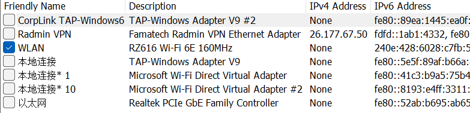
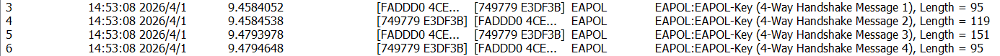
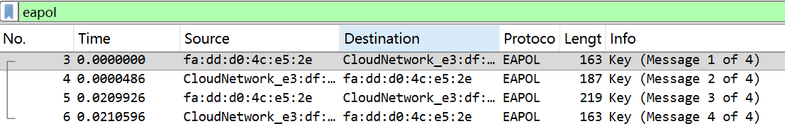
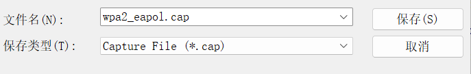
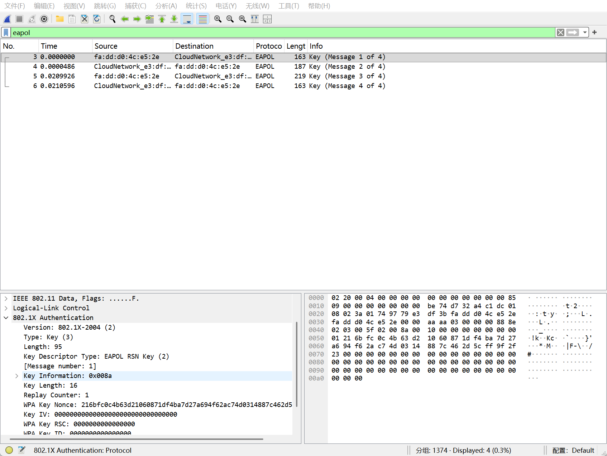
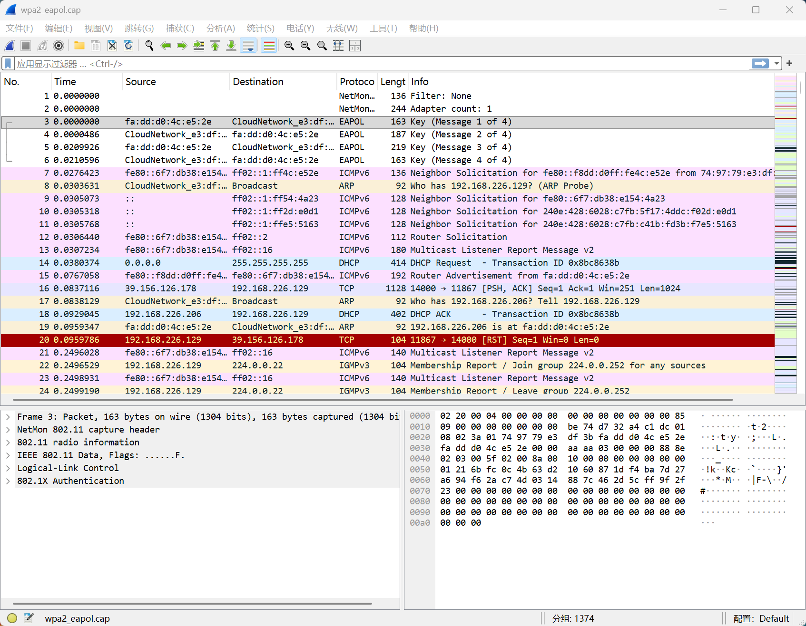
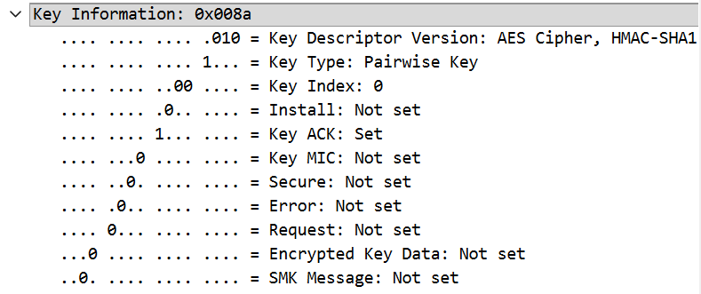
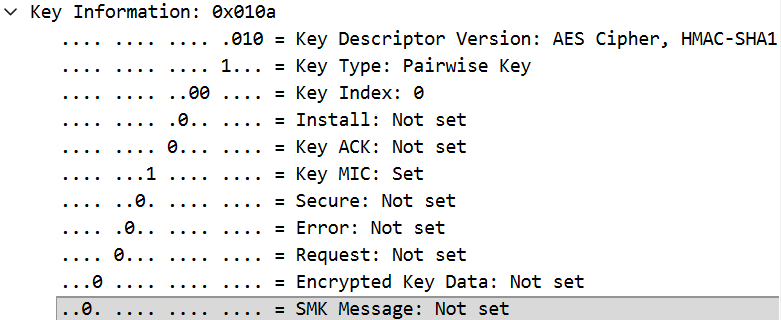
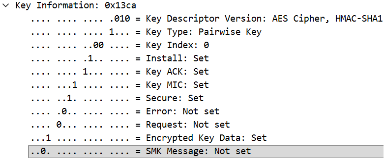
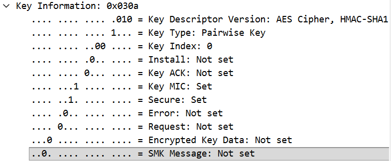

# 密码学/信息安全综合实验报告
实验名称：WPA/WPA2协议分析实验——基于手机热点的四次握手抓包与分析
学号：2310511 姓名：李冉婧 班级：信息安全

## 1、实验目的
1. 掌握Wireshark等抓包工具的使用方法，能够成功捕获WiFi网络中的EAPOL-Key帧；
2. 深入理解WPA/WPA2-PSK协议的四次握手流程，明确各握手阶段的核心作用；
3. 分析EAPOL-Key帧的关键字段含义，理解密钥派生和验证的底层逻辑；
4. 调研WPA3协议的核心机制，对比分析WPA2与WPA3在安全性上的差异，理解无线网络安全协议的演进思路。

## 2、实验环境
### 硬件配置
- 计算机：搭载无线网卡的台式机/笔记本（内存8GB及以上）；
- 移动设备：支持WPA2-PSK模式的智能手机（用于开启无线热点）。

### 软件配置
- 抓包工具：Wireshark（最新版）；
- 操作系统：Windows 10/11（以管理员权限运行软件）；
- 网络环境：手机搭建的WPA2-PSK加密无线热点。

## 3、实验原理
WPA/WPA2-PSK协议的四次握手是认证者（AP/手机热点）与请求者（客户端计算机）在不直接传输主密钥的前提下，协商生成会话密钥（PTK）和组密钥（GTK）的核心过程，双方均通过预共享密码（PSK）派生相同的主密钥（PMK），再基于随机数等信息派生临时会话密钥，实现单播和组播数据的加密传输。

**四次握手核心流程**：
1. **第一次握手（AP→客户端）**：AP生成随机数ANonce并发送给客户端，客户端以此为基础准备派生PTK；
2. **第二次握手（客户端→AP）**：客户端生成随机数SNonce，结合ANonce、PMK派生PTK，并计算MIC随SNonce发送给AP，AP验证MIC确认客户端拥有合法PMK；
3. **第三次握手（AP→客户端）**：AP用PTK加密GTK后发送给客户端，同时附带MIC，客户端验证MIC确认AP身份并接收GTK；
4. **第四次握手（客户端→AP）**：客户端向AP发送MIC，确认密钥已成功安装，双方开始使用协商的密钥进行加密通信。

**核心密钥派生公式**：
- PMK = PBKDF2(HMAC-SHA1, PSK, SSID, 4096, 256)
- PTK = PRF(PMK, “Pairwise key expansion”, min(AA, SA) || max(AA, SA) || min(ANonce, SNonce) || max(ANonce, SNonce))

四次握手流程图：
```
          AP（认证者）                客户端（请求者）
              |                          |
              | 发送ANonce               |
              |------------------------->|
              |                          | 生成SNonce，派生PTK
              | 接收SNonce+MIC，验证MIC  |
              |<-------------------------| 验证通过则确认客户端合法性
              | 派生PTK，加密GTK+MIC     |
              |------------------------->| 验证MIC，接收并安装GTK/PTK
              | 接收MIC，确认密钥安装    |
              |<-------------------------| 密钥安装完成，开始加密通信
              |                          |
```

## 4、实验步骤
1. **环境准备**：在智能手机中开启无线热点，设置热点名称（SSID）和WPA2-PSK加密密码，确保热点正常广播；在计算机中安装并打开Wireshark，以**管理员身份**运行软件，避免权限不足导致抓包失败。
2. **配置抓包接口**：在Wireshark的捕获界面中，选择计算机的**无线网卡接口**（显示为WiFi/WLAN），确认接口处于可用状态，无需额外设置捕获过滤器，直接开始捕获。



3. **触发四次握手**：在计算机中搜索并连接已搭建的手机热点，输入正确的WPA2-PSK密码，完成首次连接，此时Wireshark将捕获到连接过程中的所有网络帧，包括核心的4个EAPOL-Key帧。



4. **过滤并保存抓包数据**：在Wireshark的过滤器输入框中输入`eapol`，筛选出所有EAPOL协议帧，确认捕获到4个连续的EAPOL-Key帧（对应四次握手），将抓包数据保存为.cap格式文件，便于后续分析。





5. **分析EAPOL-Key帧**：依次展开每个EAPOL-Key帧的详细字段，记录Nonce、MIC、Replay Counter、Key Information等关键信息，分析各字段在四次握手中的作用和取值特征。



6. **调研WPA3协议**：通过查阅WiFi联盟官方文档、网络安全技术资料和相关文献，梳理WPA3协议的核心机制（SAE握手、前向安全、OWE模式），对比WPA2的安全缺陷，分析WPA3的改进思路和安全性提升点。

## 5、抓包分析
本次实验成功捕获WPA2-PSK协议四次握手的4个EAPOL-Key帧，通过Wireshark筛选后，帧编号依次为3、4、5、6，分别对应第一次至第四次握手，核心字段分析如下表所示：











| 握手次数 | 帧编号 | 源MAC/目的MAC | 核心关键字段 | 字段取值/特征分析 |
|----------|--------|---------------|--------------|------------------|
| 第一次握手（AP→客户端） | 3 | fa:dd:d0:4c:e5:2e（AP）→CloudNetwork_e3:df:3b（客户端） | Key Information | 0x008a，指定密钥描述符版本为AES+HMAC-SHA1，密钥类型为成对密钥，设置Key ACK标志，未设置MIC和加密密钥数据标志 |
|          |        |               | ANonce | 216bfc0c4b63d21060871df4ba7d27a694f62ac74d0314887c462d5cff9f2f23（32字节随机数，AP生成，用于PTK派生） |
|          |        |               | Replay Counter | 1（初始值，防止重放攻击） |
|          |        |               | WPA Key MIC | 全0（无MIC验证，仅传输ANonce） |
| 第二次握手（客户端→AP） | 4 | CloudNetwork_e3:df:3b（客户端）→fa:dd:d0:4c:e5:2e（AP） | Key Information | 0x010a，设置Key MIC标志，确认客户端已计算MIC并附带 |
|          |        |               | SNonce | f47887f78d799d5bc1dd7baff04ec01eb38e4dc788608b5ba41b9c8c50c4c797（32字节随机数，客户端生成，与ANonce共同派生PTK） |
|          |        |               | Replay Counter | 1（与AP保持一致，防止重放） |
|          |        |               | WPA Key MIC | b556814eaf60218091efbbbb1fce9936（客户端基于PTK计算，用于AP验证其合法性） |
|          |        |               | Key Data | 包含RSN信息，指定组密码套件为AES-CCM，认证方式为PSK |
| 第三次握手（AP→客户端） | 5 | fa:dd:d0:4c:e5:2e（AP）→CloudNetwork_e3:df:3b（客户端） | Key Information | 0x13ca，设置Install、Key ACK、Key MIC、Secure、Encrypted Key Data标志，确认传输加密的GTK并要求客户端安装密钥 |
|          |        |               | Replay Counter | 2（自增1，区分重传和新帧） |
|          |        |               | ANonce | 与第一次握手一致（保证PTK派生一致性） |
|          |        |               | WPA Key MIC | dceec1d909f4095bbbac1c5fe10bd53e（AP基于PTK计算，用于客户端验证AP身份） |
|          |        |               | Key Data | 56字节加密数据（包含用PTK加密的GTK，客户端解密后获取组密钥） |
| 第四次握手（客户端→AP） | 6 | CloudNetwork_e3:df:3b（客户端）→fa:dd:d0:4c:e5:2e（AP） | Key Information | 0x030a，设置Key MIC、Secure标志，确认密钥已安装并完成验证 |
|          |        |               | Replay Counter | 2（与AP第三次握手一致） |
|          |        |               | WPA Key Nonce | 全0（无需传输随机数，仅发送确认MIC） |
|          |        |               | WPA Key MIC | ddffe6b10275306a40ac4bd2522527dd（客户端发送的确认MIC，AP验证后完成握手） |

**抓包核心结论**：
1. 四次握手的Nonce具有**单向唯一性**，AP的ANonce在第一次握手后保持不变，客户端的SNonce仅在第二次握手传输，为PTK派生提供唯一随机因子；
2. Replay Counter随握手过程**逐次自增**，有效防止攻击者重放旧的握手帧进行伪造攻击；
3. MIC标志仅在第二次及以后握手设置，是双方互相验证身份的核心依据，未设置MIC的帧仅用于传输基础随机数；
4. GTK通过PTK加密后在第三次握手传输，保证组密钥在传输过程中的安全性，避免明文泄露。

## 6、安全性分析
结合本次抓包结果和WPA2-PSK协议原理，该协议存在以下核心安全缺陷：
1. **易受离线字典攻击**：四次握手的关键数据（ANonce、SNonce、MAC地址、MIC）可被攻击者捕获，攻击者无需与AP交互，只需离线枚举弱密码，通过派生PMK、PTK验证MIC是否匹配，即可破解PSK，本次抓包的MIC字段为攻击者提供了直接的验证依据；
2. **存在KRACK攻击漏洞**：协议允许AP重传第三次握手帧，若攻击者干扰第四次握手的传输，AP会反复发送第三次握手帧，导致客户端重新安装PTK，重置Nonce计数器，造成Nonce重用，攻击者可利用相同的密钥流解密甚至伪造数据包；
3. **前向安全性缺失**：PTK基于固定的PMK派生，若PSK泄露，攻击者可通过捕获的握手数据派生所有历史会话的PTK，解密过去的所有加密流量；
4. **重放攻击风险**：尽管设置了Replay Counter，但仅为简单的数值自增，若攻击者破解了某次会话的密钥，可通过修改Counter值进行重放攻击，本次抓包中Counter仅为1、2，取值简单，防护性较弱。

## 7、总结与思考
### 实验收获
1. 成功掌握了Wireshark的抓包和过滤技巧，理解了**管理员权限**和**无线网卡接口选择**在WiFi抓包中的关键作用，明确了`eapol`过滤器在筛选握手帧中的核心价值；
2. 透过实际抓包数据，直观理解了WPA2-PSK四次握手的流程，不再局限于理论知识，能够对应每个握手阶段的帧结构和字段特征，明确了ANonce、SNonce、MIC等字段在密钥协商和身份验证中的实际作用；
3. 结合抓包结果分析了WPA2-PSK协议的安全缺陷，将帧字段特征与攻击原理关联，比如MIC字段的存在是离线字典攻击的前提，Replay Counter的简单设计导致重放攻击风险，加深了对无线网络安全协议“字段设计决定安全性”的理解；
4. 系统调研了WPA3协议的核心机制，梳理了无线网络安全协议从WEP到WPA、WPA2再到WPA3的演进逻辑，理解了安全协议设计中“加密算法升级、握手机制优化、攻击防护强化”的核心思路。

### 遇到的问题与解决方法
实验初期曾出现无法捕获EAPOL帧的问题，排查后发现是无线网卡的问题，导致wireshark无法捕获到热点的认证帧，以管理员权限运行network monitor软件后，成功捕获到四次握手的所有帧；此外，初期因未及时连接热点，抓包数据中无握手帧，通过**重新触发连接**（断开热点后再次连接），成功捕获到核心的EAPOL-Key帧。

### 拓展内容：WPA3协议相对于WPA2的改进分析
为解决WPA2-PSK协议的安全缺陷，WiFi联盟于2018年推出WPA3协议，通过**SAE握手机制**、**强前向安全**、**OWE模式**三大核心改进，大幅提升了无线网络的安全性，以下为详细分析：
#### 7.3.1 SAE握手（Simultaneous Authentication of Equals）
SAE握手（也称为Dragonfly握手）替代了WPA2的四次握手，是WPA3最核心的改进，本质是**对等实体同时认证的密钥交换机制**，基于离散对数/椭圆曲线密码学实现，核心特征如下：
1. **无离线字典攻击可能**：SAE握手不传输可用于离线验证的MIC或密钥派生因子，攻击者即使捕获所有握手帧，也无法离线枚举密码进行验证，必须与AP进行在线交互，而AP可通过速率限制等方式抵御暴力破解；
2. **双向同时认证**：AP和客户端在握手过程中同时验证对方的身份，无需依赖单独的MIC验证步骤，有效防止伪AP（Evil Twin）钓鱼攻击，解决了WPA2中客户端无法有效验证AP身份的问题；
3. **独立会话密钥**：每次握手都基于随机生成的临时密钥对进行交换，即使同一客户端多次连接同一AP，也会生成不同的会话密钥，避免密钥复用带来的安全风险。

与WPA2四次握手相比，SAE握手从“基于固定PMK的密钥派生”升级为“基于椭圆曲线的动态密钥交换”，从根源上解决了离线字典攻击这一WPA2最致命的安全缺陷。

#### 7.3.2 前向安全（Forward Secrecy）
WPA3实现了**强前向安全**，弥补了WPA2前向安全性缺失的缺陷，核心实现方式为：
1. **会话密钥与长期密钥解耦**：WPA3的会话密钥（PTK）不再基于固定的PSK（长期密钥）直接派生，而是通过SAE握手过程中的**临时椭圆曲线密钥对**交换生成，PSK仅用于身份认证，不参与会话密钥的计算；
2. **临时密钥一次一用**：每次握手生成的临时密钥对在会话结束后立即销毁，无法被恢复或重用；
3. **历史流量不可解密**：即使PSK泄露，攻击者也无法通过泄露的长期密钥推导任何历史会话的密钥，因此无法解密过去的加密流量，实现了“长期密钥泄露不影响历史会话安全”的前向安全目标。

而WPA2的PTK直接基于固定PMK派生，PSK泄露则所有历史会话的PTK均可被推导，完全不具备前向安全能力。

#### 7.3.3 OWE模式（Opportunistic Wireless Encryption）
OWE模式专为**开放式WiFi热点**（如商场、机场、咖啡馆的无密码热点）设计，解决了WPA2中开放式热点**流量明文传输**的问题，核心特征如下：
1. **无密码但加密传输**：OWE模式无需用户输入密码，客户端与AP连接时自动通过椭圆曲线密钥交换协商临时会话密钥，实现数据加密传输，防止攻击者嗅探、抓包获取明文流量；
2. **简单易部署**：AP只需开启OWE模式，无需配置PSK，客户端无需任何手动设置，与连接开放式热点的操作一致，兼顾便捷性和安全性；
3. **防中间人攻击**：OWE模式通过密钥交换实现端到端加密，攻击者无法在中间节点解密或篡改流量，解决了开放式热点的中间人攻击问题。

WPA2的开放式热点无任何加密措施，所有流量均以明文传输，用户的账号、密码、聊天记录等信息极易被窃取，OWE模式则让开放式热点实现了“零配置加密”，大幅提升了公共WiFi的安全性。

#### 7.3.4 WPA2与WPA3安全性核心差异
| 安全特性 | WPA2-PSK | WPA3-PSK |
|----------|----------|----------|
| 离线字典攻击 | 易受攻击，捕获握手帧后可离线破解弱密码 | 完全防御，无离线验证依据，仅支持在线交互 |
| 前向安全 | 无，PSK泄露导致历史流量全解密 | 强前向安全，PSK泄露不影响历史会话 |
| 伪AP钓鱼攻击 | 易受攻击，客户端无法验证AP身份 | 有效防御，SAE双向同时认证AP和客户端身份 |
| 开放式热点安全 | 明文传输，无任何加密 | OWE模式自动加密，防嗅探和中间人攻击 |
| 密钥派生方式 | 基于固定PMK派生PTK，密钥复用风险高 | 基于椭圆曲线动态交换密钥，一次一用，无复用 |
| KRACK攻击防护 | 存在漏洞，易被利用Nonce重用 | 已修复，握手机制禁止密钥重安装，防止Nonce重置 |

### 整体总结
在实验过程中wireshark捕捉不到eapol，查阅资料后发现是无线网卡的问题，所以只能使用network monitor进行抓包，虽然成功捕获了四次握手的EAPOL-Key帧，但由于.cap格式无法转换成.ccap，Wireshark只能打开但无法保存和另存为，也无法转换成hashcat能使用的格式，因此未能进行离线破解验证。

本次实验通过实际抓包深入理解了WPA2-PSK协议的四次握手机制和安全缺陷，同时通过调研明确了WPA3协议的改进思路。无线网络安全协议的演进，本质是**针对现有攻击手段的持续防护优化**，从WEP的RC4加密缺陷，到WPA的TKIP过渡，再到WPA2的AES-CCMP加密和四次握手，最后到WPA3的SAE握手、强前向安全和OWE模式，每一次升级都围绕“破解难度提升、攻击路径阻断、使用便捷性兼顾”三大核心目标。

在实际应用中，WPA3虽安全性大幅提升，但受限于设备兼容性，目前仍与WPA2共存，而作为用户，在使用WiFi网络时，应优先选择WPA3加密的热点，同时设置**12位以上的随机字符组合密码**，避免弱密码被离线破解，在使用公共开放式热点时，尽量连接开启OWE模式的WPA3热点，保障自身数据安全。

