# 实验4：使用Burp Suite对HTTPS流量进行中间人篡改

## 1. 实验目的
1. 初步了解Burp Suite的基本使用方式。
2. 掌握中间人攻击原理、TLS保护通信过程，以及对HTTPS实施中间人攻击的具体流程。
3. 在实践中加深对中间人流量劫持与HTTPS证书信任机制的理解。

## 2. 实验原理

### 2.1 中间人攻击（MITM）
中间人攻击是攻击者插入通信双方之间，拦截、解密、转发甚至篡改通信内容的一类攻击。常见实现手段包括ARP欺骗、DNS劫持、恶意热点等。本实验使用“自建热点 + Burp代理 + 在手机端信任Burp CA证书”的方式，构造可解密HTTPS流量的中间人环境。

### 2.2 TLS保护通信过程
TLS通信可分为三个阶段：
1. 握手阶段：客户端与服务器协商TLS版本和加密套件，服务器下发证书，客户端验证证书后完成密钥交换并生成会话密钥。
2. 数据传输阶段：双方使用会话密钥进行对称加密，保障机密性和完整性。
3. 关闭阶段：双方通过关闭通知安全结束连接。

### 2.3 HTTPS中间人攻击成立条件
HTTPS安全依赖证书链信任。若客户端信任了攻击者控制的根证书，攻击者就可以动态签发“伪造但被信任”的站点证书，实现：
1. 拦截客户端HTTPS请求；
2. 与客户端建立一条“看似可信”的TLS连接；
3. 与真实服务器建立另一条TLS连接；
4. 在中间完成解密、篡改、再加密和转发。

### 2.4 Burp Suite作用
Burp Suite提供HTTP/HTTPS代理、拦截、重放和修改请求/响应等能力。在本实验中主要使用其代理监听、拦截和响应修改功能。

## 3. 实验环境
1. 攻击端：Windows笔记本（安装Burp Suite，自建Wi-Fi热点）。
2. 被攻击端：Android手机（连接攻击端热点，安装并信任Burp CA证书）。
3. 网络条件：手机所有流量经过Burp代理。

## 4. 实验过程

### 步骤0：检查本机网络配置
确认PC网络可用，便于后续共享热点和代理监听。

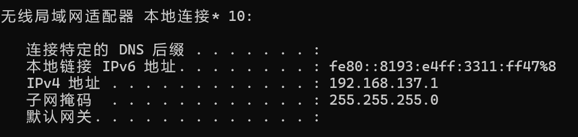

### 步骤1：导出Burp CA证书
在Burp中导出CA证书，供手机安装。

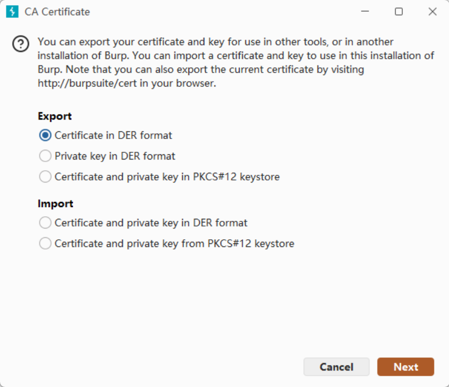

### 步骤2：手机安装Burp证书
将证书导入手机，作为用户证书安装。

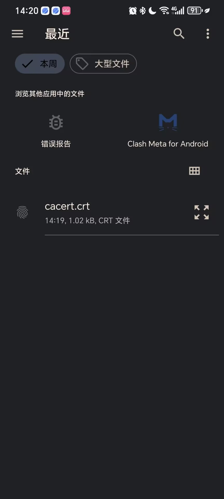

### 步骤3：检查证书信任状态
在手机证书设置中确认该证书已被信任，否则HTTPS无法被正常代理。

### 步骤4：PC端配置热点
在电脑上开启移动热点，作为手机接入网络。

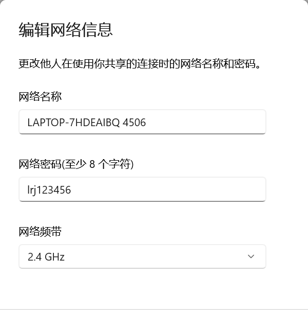

### 步骤5：手机连接攻击端热点
让手机接入该热点，确保流量路径受控。

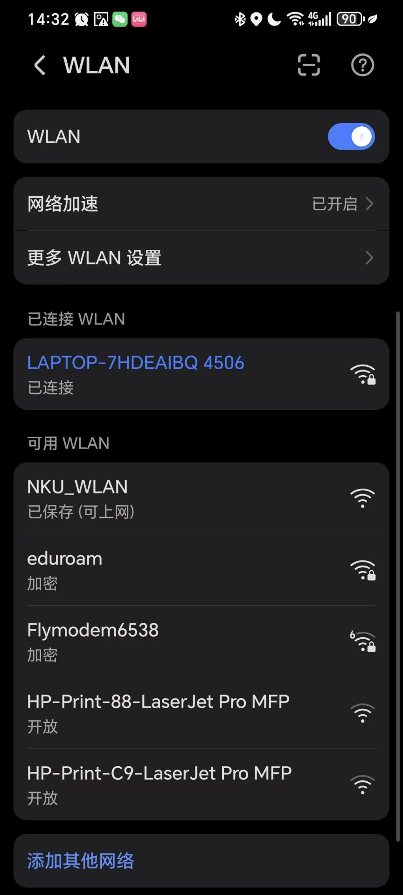

### 步骤6：确认手机IP
在PC侧观察到手机分配到的IP地址，便于后续确认流量来源。

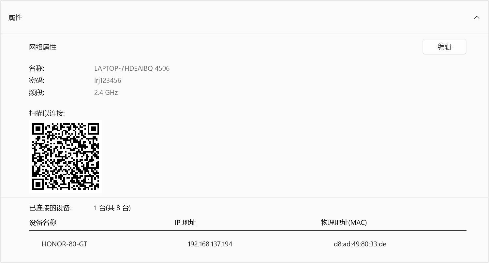

### 步骤7：手机端修改代理高级选项
在手机Wi-Fi高级选项中手动设置代理（主机为PC热点地址，端口为Burp监听端口）。

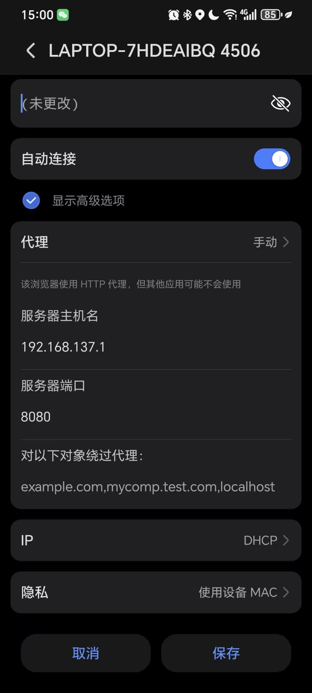

### 步骤8：Burp添加监听
在Proxy Listener中添加/确认监听地址与端口，保证可接收手机流量。

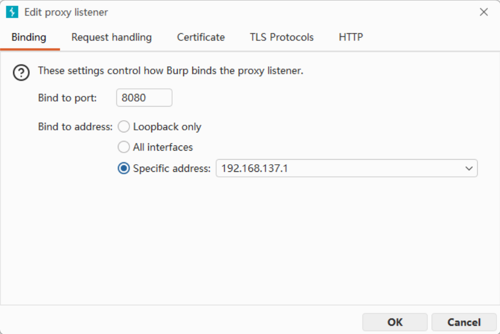

### 步骤9：验证已成功拦截手机请求
打开手机浏览器访问HTTPS网站，Burp中出现请求，说明中间人链路搭建成功。

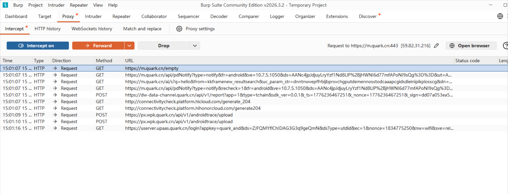

### 步骤10：开启对响应包拦截
在Burp中启用响应拦截，准备修改服务端返回内容。

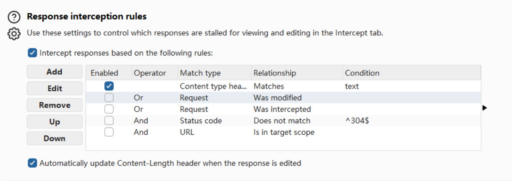

### 步骤11：拦截搜索hello的请求包
在手机端发起关键词“hello”请求，Burp捕获到请求数据。

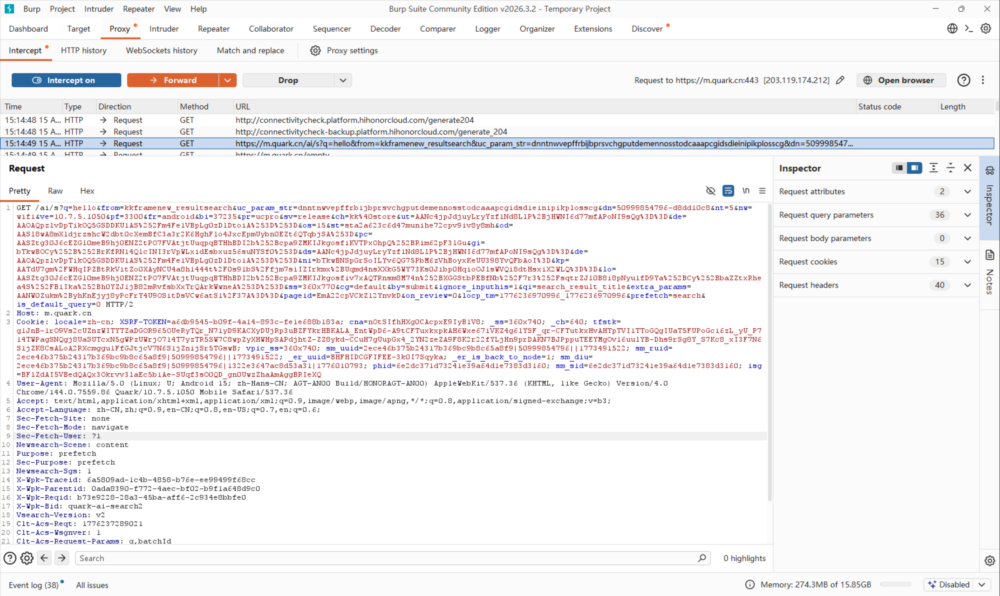

### 步骤12：拦截到对应响应包
Burp捕获到服务端响应，进入可编辑状态。

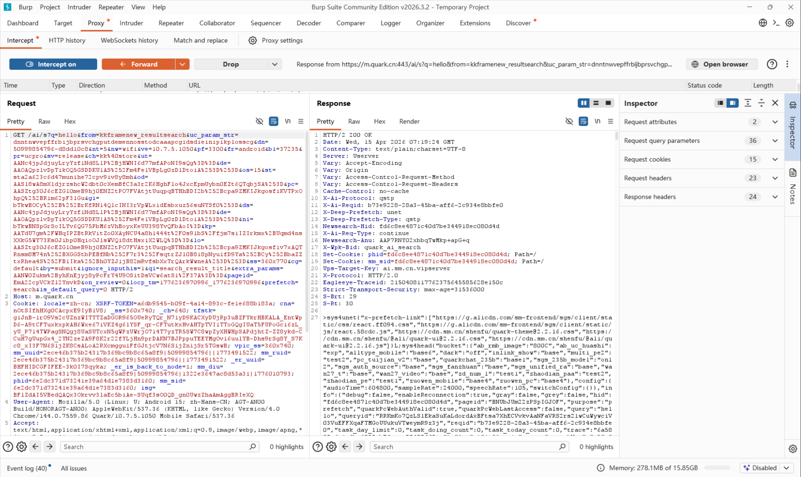

### 步骤13：定位并选中需修改字段
在拦截内容中选中目标字符串，准备篡改。

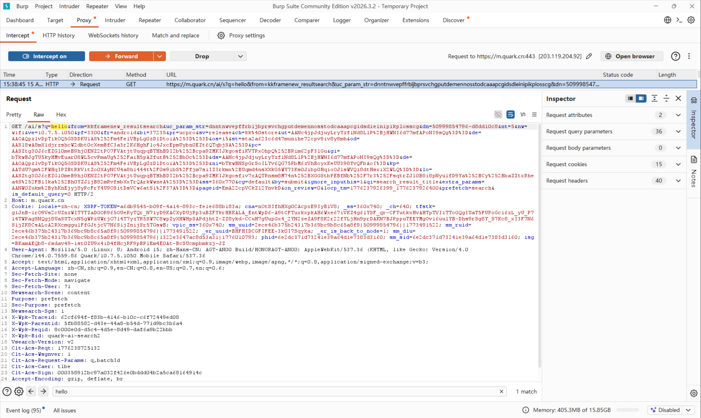

### 步骤13（默认浏览器场景）
在默认浏览器下执行同类操作，验证拦截与篡改流程一致。

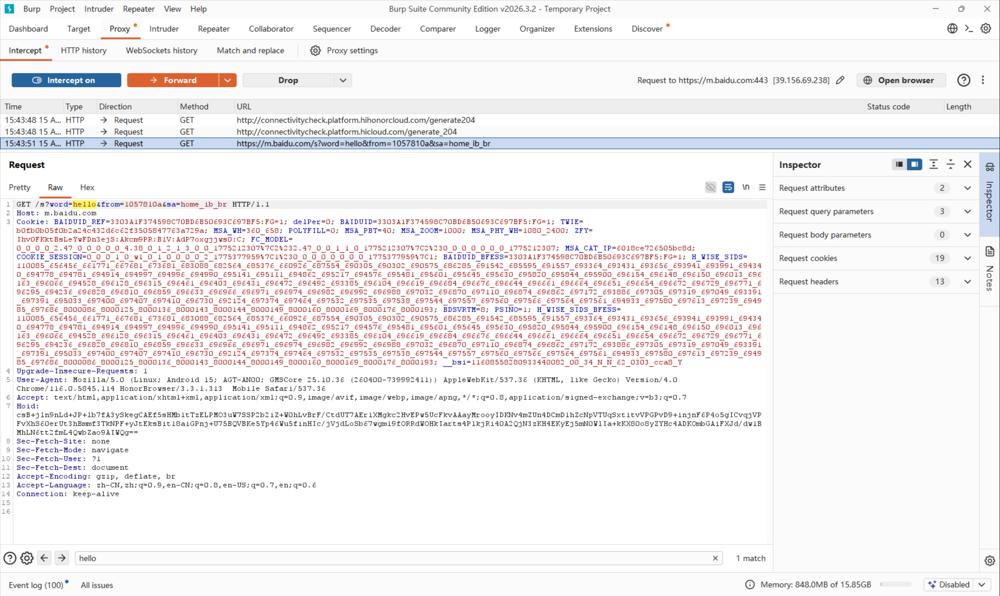

### 步骤14：将内容改为bbbb并放行
修改响应中的目标内容（hello -> bbbb），然后Forward转发给手机。

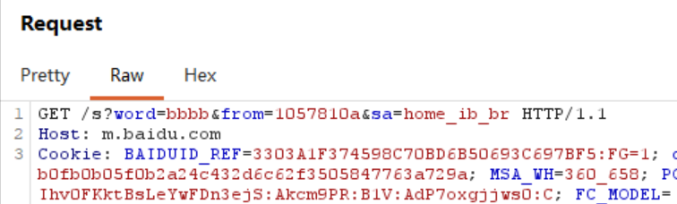

### 步骤15：确认篡改后响应
Burp中可见被修改后的响应已成功发出。

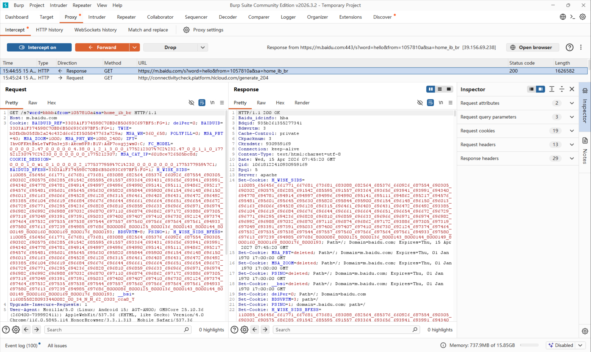

### 步骤16：手机浏览器看到被篡改结果
终端页面显示被替换后的内容，证明中间人篡改生效。

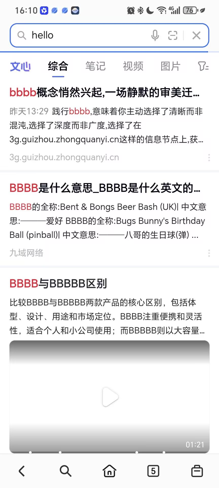

## 5. 关键步骤解析
1. 证书信任是前提：若手机未信任Burp CA证书，HTTPS会因证书校验失败而中断。
2. 代理链路要闭环：手机必须连接攻击端热点，并正确配置手动代理到Burp监听端口。
3. 请求与响应都可操作：开启响应拦截后，可在Burp中直接修改响应正文，再转发给客户端。
4. 本质是“双TLS连接”：攻击者分别与客户端、服务器建立TLS，处于可解密中间位置。

## 6. 对APP流量拦截尝试与分析
在完成浏览器场景验证后，进一步尝试对非浏览器APP进行流量拦截与篡改。该类场景常见失败原因如下：
1. APP启用了证书固定（Certificate Pinning），即使系统信任用户证书也会拒绝连接。
2. APP采用自定义网络栈或额外安全校验（如双向证书、完整性校验），导致Burp难以直接解密。
3. Android版本和应用安全策略对“用户证书”限制更严格，部分APP默认不信任用户CA。

## 7. 实验总结与心得
1. 配置网络时需要把服务器改成电脑的ip地址，端口改成Burp监听的端口，否则手机无法正确代理流量，bp接受不到包，手机也上不了网。
2. 测试的时候发现除了浏览器发出的请求包，还有很多别的APP发出的请求包，这些包都被bp捕获了，说明手机的所有流量都经过了bp代理。因为可能会出现很包，使用用ctrl+f搜索hello，会很方便因为会标黄。
3. 在拦截到响应包后，修改hello为bbbb，放行后手机浏览器显示的结果也变成了bbbb，说明中间人攻击成功了。
4. 原本使用quark浏览器，使用时发现quark的请求包内容冗杂，所有换成了默认浏览器，发现请求包内容简洁了很多，更容易找到需要修改的字段。
5. 我在拦截请求包和响应包时，手机没有弹出安全警告，通过网络搜索发现不同厂商的手机对用户证书的信任策略不同，有些手机会弹出警告，有些则不会。

