# 行为监控与 Rootkit 隐藏对抗实验报告

## 一、 实验目的
1. 熟悉微软发布的 Detours（绕行道）技术，理解 Detours 挂钩系统 API 调用的原理。
2. 了解基于 Detours 技术的无文件 Ring3 Rootkit 工具 R77，能够安装并使用 R77 隐藏 Windows 系统上的进程、文件、注册表项、网络连接。
3. 基于 Detours 和 R77 开发一套 Windows 系统行为监控工具，能够开发记录当前系统的操作行为，例如文件操作、进程创建、注册表操作、网络连接等。

## 二、 实验内容
1. 使用 Detours 库，实现对 Windows API 函数进行挂钩 Hook，不影响函数的正常执行，将 API 函数调用的参数输出到文件中；
2. 安装并使用 R77 Rootkit 工具，隐藏系统的文件、进程、注册表项、网络连接；
3. 基于 Detours 和 R77 开发一套 Windows 系统的行为监控工具，能够至少记录当前系统的一类操作行为，例如文件操作监控工具、进程创建监控工具、注册表操作监控工具、网络连接监控工具等等。

## 三、 实验环境
- **测试环境**: VMware 虚拟机 (Windows 10)
- **开发工具**: Visual Studio 2026 (x64 MSVC 编译工具链)
- **核心依赖**: Microsoft Detours (x64)
- **恶意样本**: r77 Rootkit


## 四、 基于 Detours 库的 API 函数挂钩实验
我们需要使用 Detours 库实现对 Windows API 函数的挂钩 Hook，并将 API 函数调用的参数改变。

为了编译detours，我们需要安装 visual studio，并且安装 windows sdk。安装完成后打开 x64 Native Tools Command Prompt for VS，进入 Detours 源码文件目录中的 src 目录，输入命令 `nmake` 进行编译。因为实验环境是 x64 架构，所以编译了 x64 版本的库。编译完成后，会在 `lib.X64` 目录下生成 `detours.lib` 静态库文件。

在此之后，我们写一个测试程序来测试基础的 Hook 功能（通过拦截 `MessageBoxW` 弹窗 API 来验证），测试程序的代码是 `detours_test.cpp`，我会在实验报告最后统一附上完整代码。

我们需要在 x64 Native Tools Command Prompt for VS 中编译这个测试程序，编译命令如下：
```cmd
cl /EHsc detours_test.cpp /I "E:\Detours-main\src" /link /LIBPATH:"E:\Detours-main\lib.X64" detours.lib user32.lib
```

编译完成后我们双击测试程序 `detours_test.exe`

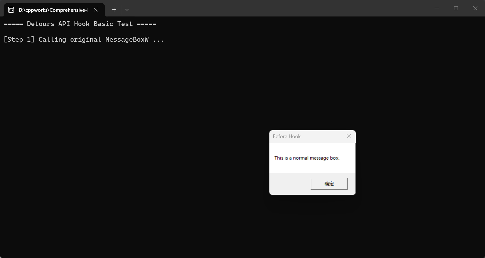

点击“确定”后，弹出第二个 MessageBox。此时程序已经在后台调用 Detours API 挂钩了 `MessageBoxW` 函数，因此这个原生弹窗的内容和标题被我们通过 Hook 强制注入与修改，追加了 `(he hooked!)` 字符串。

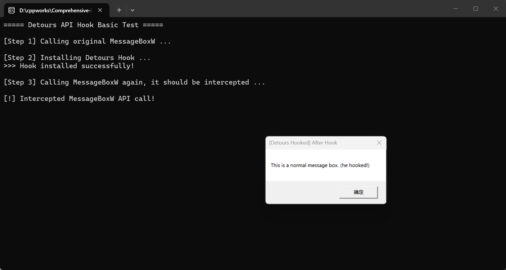

再次点击“确定”后，弹出第三个 MessageBox。由于此时程序执行了反挂钩（脱钩）操作，系统 API 恢复了原始调用路径，所以弹窗内容恢复正常。


最后一次点击“确定”后，终端输出测试结束提示，按下回车程序退出。

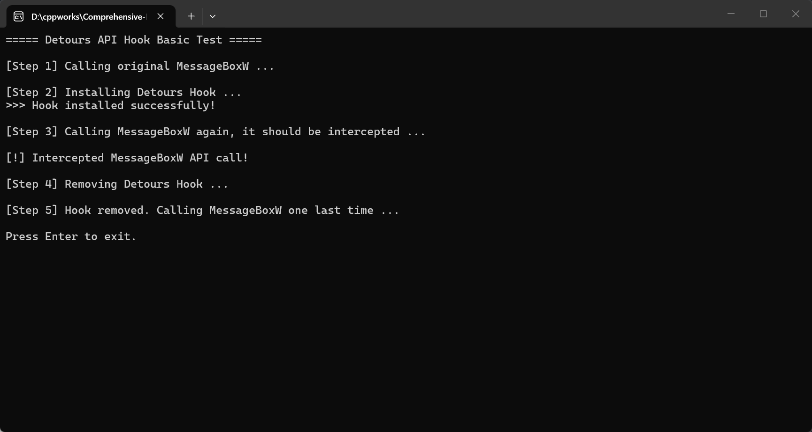

**【测试验证与阶段结论】**
通过捕获并分析 `detours_test.exe` 的运行现象：
1. 正常弹出第一个 MessageBox 弹窗。
2. 安装 Detours Hook 后，弹出第二个 MessageBox。此时原生弹窗内容成功被我们通过拦截传入参数并强制追加了 `(he hooked!)` 字符串。
3. 卸载 Hook 后，弹出第三个 MessageBox，内容恢复至未被污染的原始状态。
这完美验证了当前物理机/开发机上的 Detours 编译环境配置成功，并且直接从技术原理的层面证明：**通过篡改内存中 API 函数的地址跳转（JMP），我们可以完全拦截并随意篡改操作系统底层原生 API 的输入参数。**这一成功测试，为后续针对系统进程创建行为（`CreateProcess`）的拦截奠定了坚实的技术和环境基础。

## 五、 基于 R77 Rootkit 工具的系统信息隐藏实验
由于在上个学期的恶意代码分析防治技术课程中，我们已经完成了 R77 Rootkit 的安装和使用实验，所以我直接复用上次的实验报告内容。

### 5.1 测试文件准备
#### 5.1.1 R77程序
我们需要先在 github 中下载 r77 Rootkit 1.8.1.zip。在 github 页面的 readme 最下方有下载超链接以及解压密码：

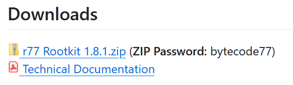

我们下载到 win10 虚拟机中并解压缩：

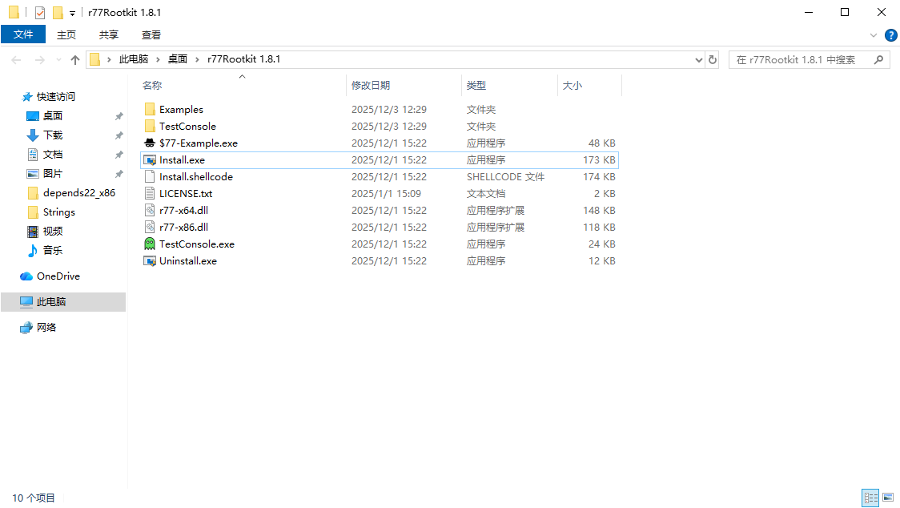

这就是我们本次实验需要使用的 R77。这时我们先不要运行 Install.exe。

#### 5.1.2 文本文件
我们在桌面新建一个 test 文件夹，里面存放测试文件。
新建一个文本文档，命名为：`$77test.txt`

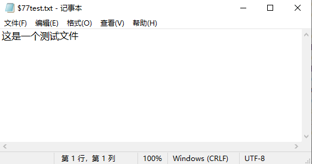

#### 5.1.3 可执行文件
我们需要一个可执行程序，因为虚拟机中有之前使用的各种分析工具，所以我复制了一份 PEView.exe 到 test 文件夹，并重新命名为：`$77PEView.exe`。
我们启动并运行 `$77PEView.exe`，随便选择一个exe，我选择的是 `strings.exe`，因为这个也是之前就下载的，直接选择很方便，不需要下载新的测试文件：

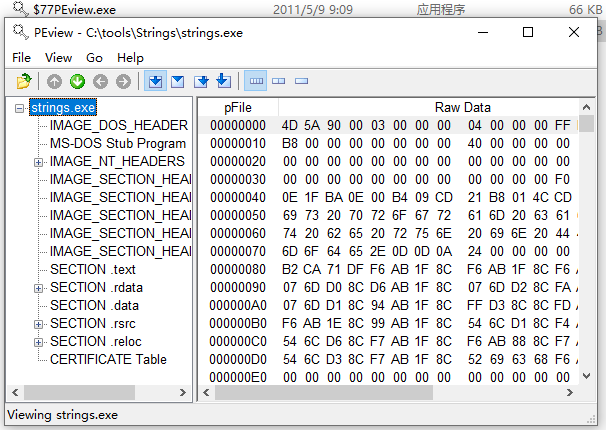

#### 5.1.4 注册表文件
现在我们需要新建一个注册表项，所以我们按住 win+r，输入 regedit，回车，并导航到 `HKEY_CURRENT_USER\Software`，右键点击 Software，新建 项(Key)，命名为 `$77test_key`。

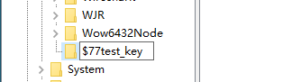

#### 5.1.5 文件夹
在 test 文件夹中再新建一个文件夹，命名为 `$77test_dir`。

#### 5.1.6 网络连接文件
为了检测 R77 对网络连接的隐藏，我们在 netcat 官网(https://eternallybored.org/misc/netcat/)下载 netcat 1.12。在 test 文件夹中解压缩，将 netcat 的可执行文件改名为 `$77net_test.exe`。
设置 12345 端口的监听，并在另一个 cmd 窗口中输入 `netstat -ano`，观察到 12345 网络连接可见。

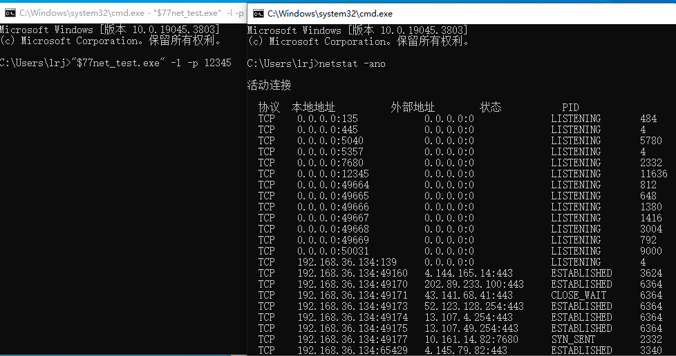

这时我们的测试文件就准备好了，我们的 test 文件夹中应包含以下内容：

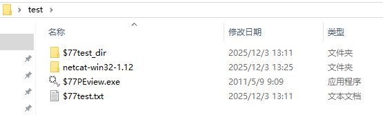

我们打开任务管理器观察目前的进程：

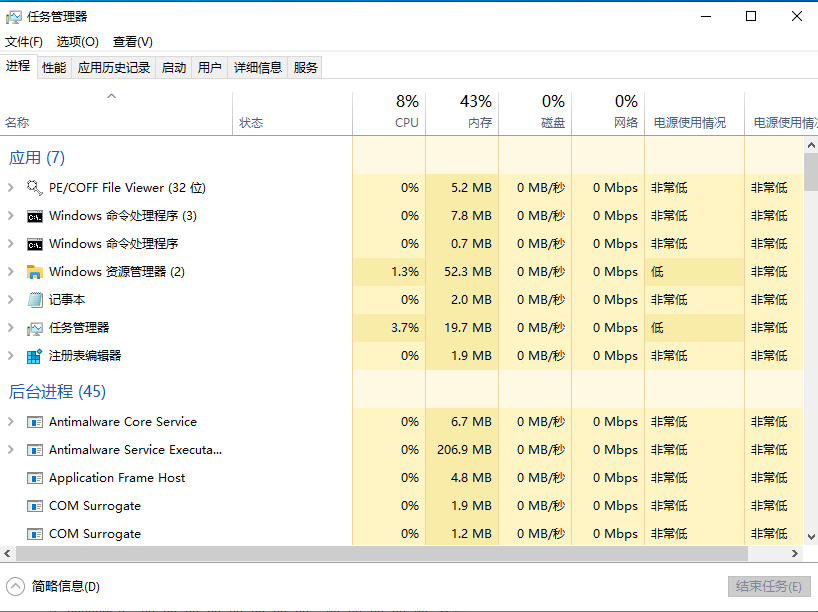

注意此时运行中的 PEView。

### 5.2 运行 R77 并观察
#### 5.2.1 R77运行
双击安装程序 Install.exe，需要管理员身份才能安装。

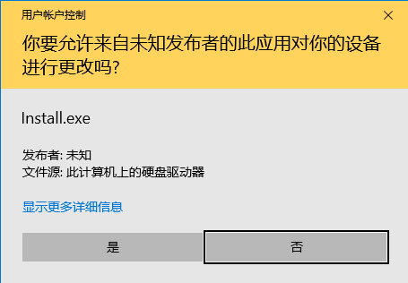

R77 运行后不会有弹窗显示，我们直接对隐藏功能进行检测即可：

#### 5.2.2 文本文件和文件夹隐藏测试

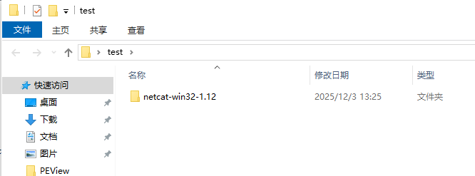

我们可以看到，带有 `$77` 开头的测试文件和文件夹全部被隐藏了。

#### 5.2.3 可执行文件隐藏测试
我们在准备测试文件时运行了一个 PEview 并且没有关闭进程，我们再次打开任务管理器观察：

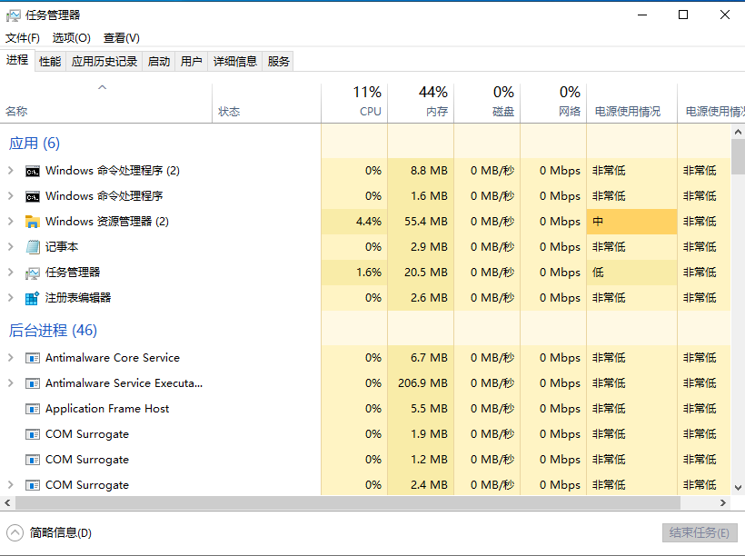

发现 `$77PEView.exe` 的进程已经在任务管理器中被完美隐藏了。

#### 5.2.4 注册表隐藏测试
我们通过相同的步骤打开 regedit，找到路径 `HKEY_CURRENT_USER\Software`。

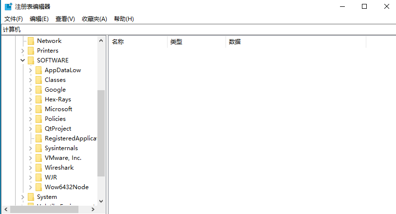

发现我们刚才新建的 `$77test_key` 注册表项被隐藏。

#### 5.2.5 网络连接隐藏测试
我们刚刚通过 `$77net_test.exe` 对 12345 端口建立了监听，我们在另一个 cmd 窗口再次运行 `netstat -ano` 检查：

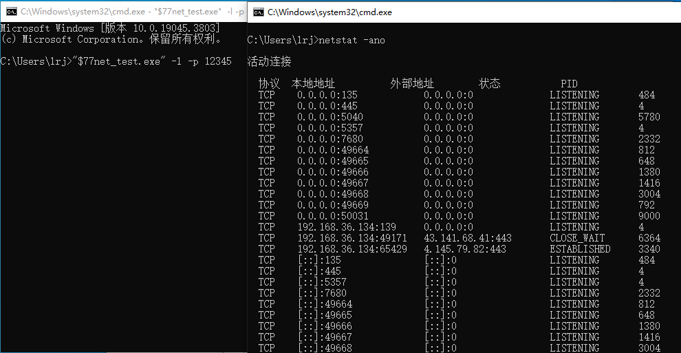

发现对 12345 端口的监听也被隐藏了。至此，对 R77 程序各个维度的隐藏效果验证完成。

#### 5.2.6 卸载恢复
我们运行 Uninstall.exe 对 R77 彻底清除：

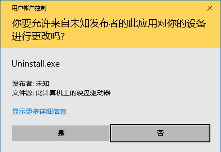

可以看到，卸载程序运行后的 test 文件夹已成功恢复：

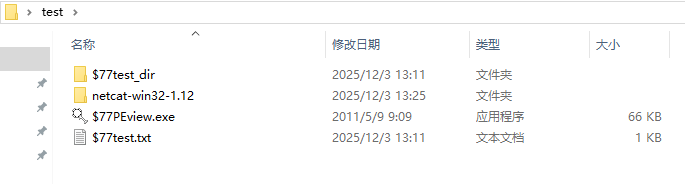

包括注册表、进程以及别的测试文件都已经全部恢复原状。

## 六、 基于 Detours 和 R77 Rootkit 的 Windows 行为监控工具编写实验
在单点测试 Detours 的基础 Hook 功能，以及单独验证了 R77 的隐藏破坏力后，本阶段将两者结合，编写一套进程创建监控工具，来测试r77隐藏效果。

### 6.1 行为监控工具的设计机制
为了实现监控，我们需要把带有 Detours Hook 逻辑的 DLL (动态链接库) 注入到 Windows 的系统核心进程 `explorer.exe` (资源管理器) 中。由于用户在桌面双击运行、Win+R 运行等大多数程序启动行为都是由 `explorer.exe` 作为父进程发起调用的，借此我们就可以拦截到大部分应用程序的启动操作。

**监控设计如下：**
1. **注入器 (`injector.cpp`)**：利用 `OpenProcess`、`VirtualAllocEx` 和 `CreateRemoteThread`，将我们编写的 DLL 强行拉起并注入到当前运行的 `explorer.exe` 中。
2. **监控核心 (`monitor_dll.cpp`)**：在 DllMain 附加阶段，调用 Detours 拦截底层的 `CreateProcessA` 和 `CreateProcessW` 函数。拦截后，首先抓取传入的执行路径和命令行参数并写入到桌面新建的 `process_monitor.log` 日志中，随后再放行原始进程启动，达到“无感监听”的效果。

### 6.2 编译与环境准备
我们将 `monitor_dll.cpp` 编译为 `monitor_dll.dll`，并将 `injector.cpp` 编译出来，做好注入准备：

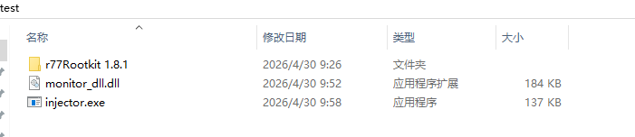


### 6.3 注入与原生行为监控测试
为了保持注入环境的干净，我们可以在任务管理器中先重启一次“Windows 资源管理器”，然后以管理员权限运行注入器：

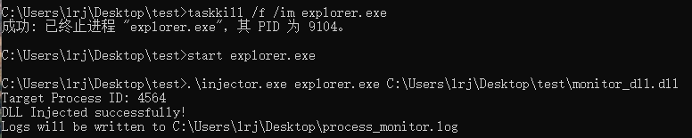

输入目标进程 `explorer.exe` 和我们的 DLL 绝对路径，终端提示“DLL Injected successfully!”：

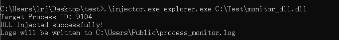

可以看到，注入成功后，桌面上自动生成了 `process_monitor.log` 文件，我们打开查看：

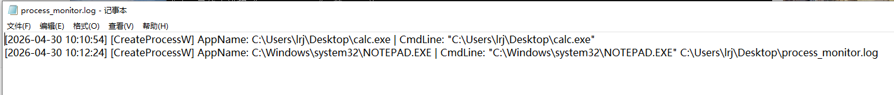

说明监控此时已悄然上架。我们立刻在系统中尝试启动 Windows 自带的计算器 `calc.exe`：

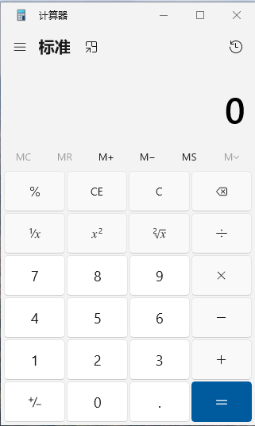


### 6.4 监控盲区与 R77 的对抗注入
我们在此监控环境下，以管理员身份运行 R77 的 `Install.exe`：

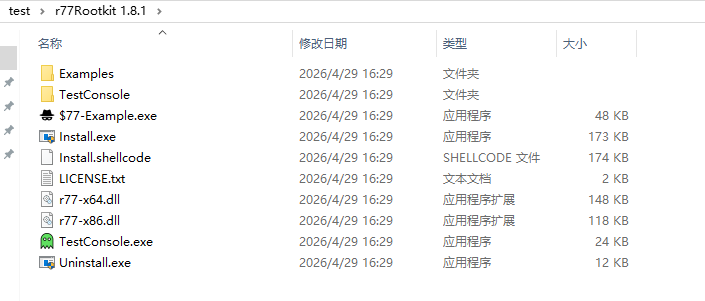

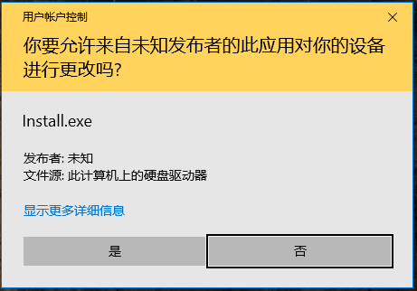

我们可以发现，在初步执行阶段，我们的监控工具仍然能够捕获到 R77 安装程序 `Install.exe` 的启动动作并将其记录在案。
但是一旦 r77 安装完毕并触发其系统级全局挂钩（Hook），随之产生了剧烈对抗：我们发现之前的测试文件已经被成功隐藏了：


并且在这之后，我们再次启动任何应用，`process_monitor.log` 就不再产生新的记录。
打开我们桌面自动生成的 `process_monitor.log` 查看：

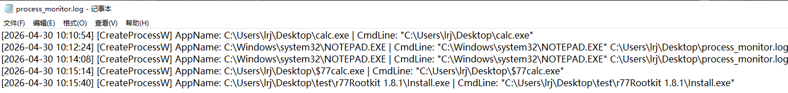

能清晰地观察到，日志文件中准确无误地记录了通过 `CreateProcessW` 调用的时间、程序路径、以及命令行参数。**这就意味着我们编写的基于 Detours 的系统行为监控工具已生效。**

**攻防原理解析：**
R77 Rootkit 属于系统底层的恶意程序。它在部署时，会暴力抢占 Ring 3 层中的所有核心查询和执行 API。因为同一个 API在内存中如果被挂钩多次，容易发生 Hook 黑吃黑（Hook Overwriting）或者链式断裂。R77 在注入其隐藏规则时，从架构上强行覆写了我们 Detours 留下的 JMP 跳转指令，直接切断了我们自己 DLL 的执行流。
这就导致：**监控工具被致盲**。它反映了一个关键的安全对抗现象：处于同等用户态权限（Ring 3）下的监控防御工具，极容易受到高水平 Rootkit 的干扰甚至逆向篡改。

> 附验证说明：虽然我们在正常系统下被致盲，但通过重启进入 Windows 安全模式，我们依然能清晰看到那些带 `$77` 前缀的隐藏文件，印证了本次工具原理判断。

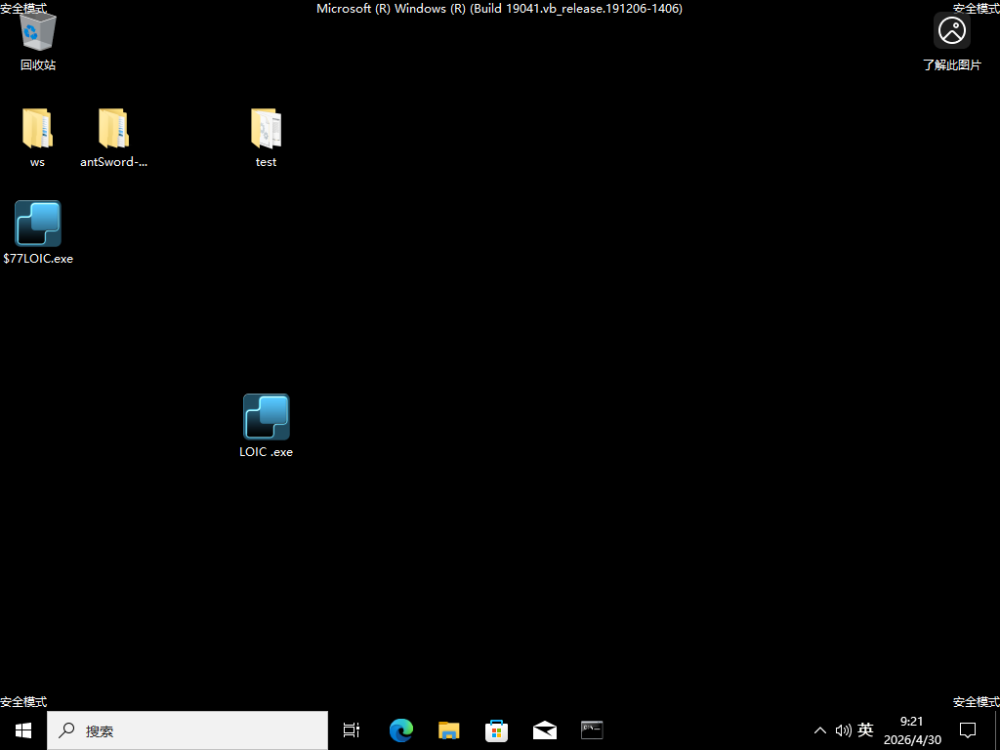

## 七、 实验结论
通过本次实验可以看出，基于全局查询 API 劫持的隐藏技术（如 R77 隐藏任务管理器显示）属于**状态类劫持**，它只能通过篡改查询结果来欺骗监控者。而基于 API Hook 技术的进程创建拦截属于**行为类监控**，它处于执行链更上游的位置。在本实验中，动态的行为监控工具在初期成功无视了 R77 的隐藏规则，精准抓取了隐藏恶意程序的启动动作。但随后的对抗现象（日志中断）也深刻揭示了在同态权限下，用户层安全监控极易遭遇 Rootkit 系统级挂钩的屏蔽与致盲，验证了深层安全防御机制的必要性。

## 八、 实验环境清理与防卸载对抗原理

在完成了行为捕获与对抗实验后，需要对虚拟机环境进行清理。针对 r77 Rootkit 提供以下两种清理方式：

### 方式一：使用官方卸载程序 (常规清理)
r77 压缩包中通常附带了一个 `Uninstall.exe` 工具。
1. **执行卸载**：在正常的系统模式下，找到 r77 的解压目录，**右键以管理员身份运行** `Uninstall.exe`。
2. **卸载原理**：该程序内置了移除 r77 注册表自启动项、计划任务以及释放系统底层挂钩（Hook）的逻辑，无需手动寻找被隐藏的文件即可执行逆向清理。
3. **完成与生效**：执行卸载程序后，卸载工具会切断核心服务并触发解除挂钩（Unhook），隐藏效果通常会**立即失效**，之前因 `$77` 前缀被隐藏的工具也会瞬间重新显示。但为了确保内存中所有被注入 DLL 的进程彻底释放资源，**建议在卸载后重启系统**。

### 方式二：利用安全模式进行物理隔离 (手动强制清理)
1. **现象解释**：在正常系统模式下，由于 r77 Hook 了底层文件遍历 API (`NtQueryDirectoryFile` 等)，我们无法通过资源管理器直接看到或删除带有特定前缀的文件。
2. **安全模式恢复**：重启系统并进入 **Windows 安全模式**。
3. **原理验证**：在安全模式下，系统仅加载最基本的驱动和服务，r77 设置好的计划任务或注册表服务无法被触发自启动，从而无法注入进程实施全局 Hook。此时系统 API 恢复未被劫持的真实状态。
4. **清理残留**：进入安全模式后，桌面上的测试工具 `$77calc.exe` 以及系统深处的 r77 本体都会显形，可直接手动删除并清理注册表。这也反向证明了 Ring 3 级别 Rootkit 对操作系统启动链的依赖性弱点。

## 九、 实验局限性与未来改进方向

1. **监控维度的局限性**：
   本实验目前的监控点主要集中在 `CreateProcessW/A` 这类**进程创建** API。由于注入目标是 `explorer.exe`，因此能完美捕获经由桌面等交互界面发起的隐藏程序启动行为。但若是 R77 利用 `CreateRemoteThread` 或 `WriteProcessMemory` 等 API 在系统后台进行隐秘的跨进程注入操作，或通过 `NtSetValueKey` 修改注册表自启项，现有的单一进程维度监控将无法捕获。
2. **未来拓展方向**：
   - **多维度 API Hook**：拓展 Detours 的挂钩范围，加入对注册表操作、网络连接和内存修改相关 API 的监控，形成更立体的行为沙箱。
   - **内核级防御下沉**：随着 Rootkit 技术的演进，仅仅在 Ring 3 (用户态) 进行 API Hook 容易被同级别的恶意软件绕过或恢复。未来可尝试开发 Windows 内核驱动（Ring 0），通过文件系统微过滤驱动（Minifilter）或内核回调（ObRegisterCallbacks）来实现极高权限的行为监控，形成更强大的降维打击能力。

## 十、 实验源码

### 10.1 `detours_test.cpp`
```cpp
#include <windows.h>
#include <iostream>
#include <string>
#include "detours.h"

// pointer to the original MessageBoxW
static int (WINAPI *TrueMessageBoxW)(HWND hWnd, LPCWSTR lpText, LPCWSTR lpCaption, UINT uType) = MessageBoxW;

// our hooked MessageBoxW function
int WINAPI HookedMessageBoxW(HWND hWnd, LPCWSTR lpText, LPCWSTR lpCaption, UINT uType) {
    std::cout << "\n[!] Intercepted MessageBoxW API call!\n";
    
    // Append the required string
    std::wstring newText = std::wstring(lpText) + L" (he hooked!)";
    std::wstring newCaption = L"[Detours Hooked] " + std::wstring(lpCaption);

    return TrueMessageBoxW(hWnd, newText.c_str(), newCaption.c_str(), uType);
}

int main() {
    std::cout << "===== Detours API Hook Basic Test =====\n\n";

    std::cout << "[Step 1] Calling original MessageBoxW ...\n";
    MessageBoxW(NULL, L"This is a normal message box.", L"Before Hook", MB_OK);

    // Initialize and install the hook
    std::cout << "\n[Step 2] Installing Detours Hook ...\n";
    DetourRestoreAfterWith();
    DetourTransactionBegin();
    DetourUpdateThread(GetCurrentThread());
    DetourAttach(&(PVOID&)TrueMessageBoxW, HookedMessageBoxW);
    LONG error = DetourTransactionCommit();

    if (error == NO_ERROR) {
        std::cout << ">>> Hook installed successfully!\n\n";
        
        std::cout << "[Step 3] Calling MessageBoxW again, it should be intercepted ...\n";
        MessageBoxW(NULL, L"If hook worked, you'll see a modified title/text.", L"After Hook", MB_OK);

        // Cleanup
        std::cout << "\n[Step 4] Removing Detours Hook ...\n";
        DetourTransactionBegin();
        DetourUpdateThread(GetCurrentThread());
        DetourDetach(&(PVOID&)TrueMessageBoxW, HookedMessageBoxW);
        DetourTransactionCommit();

        std::cout << "\n[Step 5] Calling MessageBoxW one last time, should be back to normal ...\n";
        MessageBoxW(NULL, L"This should be completely normal now.", L"After Unhook", MB_OK);
    } else {
        std::cout << ">>> Failed to hook MessageBoxW! Error code: " << error << "\n";
    }

    std::cout << "\n===== Test Finished. Press Enter to exit =====\n";
    std::cin.get();
    return 0;
}
```

### 10.2 `injector.cpp`
```cpp
#include <windows.h>
#include <stdio.h>
#include <tlhelp32.h>

DWORD FindProcessId(const char* processName) {
    PROCESSENTRY32 processInfo;
    processInfo.dwSize = sizeof(processInfo);

    HANDLE processesSnapshot = CreateToolhelp32Snapshot(TH32CS_SNAPPROCESS, NULL);
    if (processesSnapshot == INVALID_HANDLE_VALUE) {
        return 0;
    }

    Process32First(processesSnapshot, &processInfo);
    if (!strcmp(processName, processInfo.szExeFile)) {
        CloseHandle(processesSnapshot);
        return processInfo.th32ProcessID;
    }

    while (Process32Next(processesSnapshot, &processInfo)) {
        if (!strcmp(processName, processInfo.szExeFile)) {
            CloseHandle(processesSnapshot);
            return processInfo.th32ProcessID;
        }
    }

    CloseHandle(processesSnapshot);
    return 0;
}

int main(int argc, char* argv[]) {
    if (argc != 3) {
        printf("Usage: %s <Process Name> <DLL Full Path>\n", argv[0]);
        return 1;
    }

    const char* processName = argv[1];
    const char* dllPath = argv[2];

    DWORD processId = FindProcessId(processName);
    if (processId == 0) {
        printf("Could not find process: %s\n", processName);
        return 1;
    }

    HANDLE hProcess = OpenProcess(PROCESS_ALL_ACCESS, FALSE, processId);
    if (!hProcess) {
        printf("Could not open process. Error: %lu\n", GetLastError());
        return 1;
    }

    LPVOID pDllPath = VirtualAllocEx(hProcess, 0, strlen(dllPath) + 1, MEM_COMMIT, PAGE_READWRITE);
    if (!pDllPath) {
        CloseHandle(hProcess);
        return 1;
    }

    WriteProcessMemory(hProcess, pDllPath, (LPVOID)dllPath, strlen(dllPath) + 1, 0);

    HANDLE hLoadThread = CreateRemoteThread(hProcess, 0, 0,
        (LPTHREAD_START_ROUTINE)GetProcAddress(GetModuleHandleA("kernel32.dll"), "LoadLibraryA"),
        pDllPath, 0, 0);

    if (hLoadThread) {
        printf("DLL Injected successfully!\n");
        WaitForSingleObject(hLoadThread, INFINITE);
        CloseHandle(hLoadThread);
    }
    
    VirtualFreeEx(hProcess, pDllPath, 0, MEM_RELEASE);
    CloseHandle(hProcess);

    return 0;
}
```

### 10.3 `monitor_dll.cpp`
```cpp
#include <windows.h>
#include <stdio.h>
#include <detours.h>
#include <string>

#pragma comment(lib, "user32.lib")

// 文件日志路径：直接写到用户桌面上，避免任何权限限制
const char* LOG_FILE = "C:\\Users\\lrj\\Desktop\\process_monitor.log";

// 原始 API 函数指针
static BOOL(WINAPI *TrueCreateProcessW)(
    LPCWSTR lpApplicationName,
    LPWSTR lpCommandLine,
    LPSECURITY_ATTRIBUTES lpProcessAttributes,
    LPSECURITY_ATTRIBUTES lpThreadAttributes,
    BOOL bInheritHandles,
    DWORD dwCreationFlags,
    LPVOID lpEnvironment,
    LPCWSTR lpCurrentDirectory,
    LPSTARTUPINFOW lpStartupInfo,
    LPPROCESS_INFORMATION lpProcessInformation
) = CreateProcessW;

static BOOL(WINAPI *TrueCreateProcessA)(
    LPCSTR lpApplicationName,
    LPSTR lpCommandLine,
    LPSECURITY_ATTRIBUTES lpProcessAttributes,
    LPSECURITY_ATTRIBUTES lpThreadAttributes,
    BOOL bInheritHandles,
    DWORD dwCreationFlags,
    LPVOID lpEnvironment,
    LPCSTR lpCurrentDirectory,
    LPSTARTUPINFOA lpStartupInfo,
    LPPROCESS_INFORMATION lpProcessInformation
) = CreateProcessA;

// 记录日志的辅助函数
void LogProcessCreation(const char* funcName, const char* appName, const char* cmdLine) {
    FILE* file;
    // 使用追加模式，如果文件不存在则会创建。使用 _fsopen 以防止共享冲突
    if (fopen_s(&file, LOG_FILE, "a") == 0) {
        SYSTEMTIME st;
        GetLocalTime(&st);
        fprintf(file, "[%04d-%02d-%02d %02d:%02d:%02d] [%s] AppName: %s | CmdLine: %s\n",
            st.wYear, st.wMonth, st.wDay, st.wHour, st.wMinute, st.wSecond,
            funcName,
            appName ? appName : "NULL",
            cmdLine ? cmdLine : "NULL");
        fclose(file);
    }
}

// 帮助转换 WCHAR 到 char 的辅助函数
std::string WStringToString(const std::wstring& wstr) {
    if (wstr.empty()) return std::string();
    int size_needed = WideCharToMultiByte(CP_UTF8, 0, &wstr[0], (int)wstr.size(), NULL, 0, NULL, NULL);
    std::string strTo(size_needed, 0);
    WideCharToMultiByte(CP_UTF8, 0, &wstr[0], (int)wstr.size(), &strTo[0], size_needed, NULL, NULL);
    return strTo;
}

// 我们的 Hook 函数
BOOL WINAPI HookCreateProcessW(
    LPCWSTR lpApplicationName,
    LPWSTR lpCommandLine,
    LPSECURITY_ATTRIBUTES lpProcessAttributes,
    LPSECURITY_ATTRIBUTES lpThreadAttributes,
    BOOL bInheritHandles,
    DWORD dwCreationFlags,
    LPVOID lpEnvironment,
    LPCWSTR lpCurrentDirectory,
    LPSTARTUPINFOW lpStartupInfo,
    LPPROCESS_INFORMATION lpProcessInformation
) {
    std::string appName = lpApplicationName ? WStringToString(lpApplicationName) : "NULL";
    std::string cmdLine = lpCommandLine ? WStringToString(lpCommandLine) : "NULL";
    
    LogProcessCreation("CreateProcessW", appName.c_str(), cmdLine.c_str());

    return TrueCreateProcessW(
        lpApplicationName,
        lpCommandLine,
        lpProcessAttributes,
        lpThreadAttributes,
        bInheritHandles,
        dwCreationFlags,
        lpEnvironment,
        lpCurrentDirectory,
        lpStartupInfo,
        lpProcessInformation
    );
}

BOOL WINAPI HookCreateProcessA(
    LPCSTR lpApplicationName,
    LPSTR lpCommandLine,
    LPSECURITY_ATTRIBUTES lpProcessAttributes,
    LPSECURITY_ATTRIBUTES lpThreadAttributes,
    BOOL bInheritHandles,
    DWORD dwCreationFlags,
    LPVOID lpEnvironment,
    LPCSTR lpCurrentDirectory,
    LPSTARTUPINFOA lpStartupInfo,
    LPPROCESS_INFORMATION lpProcessInformation
) {
    std::string appName = lpApplicationName ? lpApplicationName : "NULL";
    std::string cmdLine = lpCommandLine ? lpCommandLine : "NULL";

    LogProcessCreation("CreateProcessA", appName.c_str(), cmdLine.c_str());

    return TrueCreateProcessA(
        lpApplicationName,
        lpCommandLine,
        lpProcessAttributes,
        lpThreadAttributes,
        bInheritHandles,
        dwCreationFlags,
        lpEnvironment,
        lpCurrentDirectory,
        lpStartupInfo,
        lpProcessInformation
    );
}

// DLL 入口点
BOOL APIENTRY DllMain(HMODULE hModule, DWORD  ul_reason_for_call, LPVOID lpReserved) {
    (void)hModule;
    (void)lpReserved;

    if (DetourIsHelperProcess()) {
        return TRUE;
    }

    if (ul_reason_for_call == DLL_PROCESS_ATTACH) {
        DisableThreadLibraryCalls(hModule);
        
        DetourRestoreAfterWith();
        
        DetourTransactionBegin();
        DetourUpdateThread(GetCurrentThread());
        DetourAttach(&(PVOID&)TrueCreateProcessW, HookCreateProcessW);
        DetourAttach(&(PVOID&)TrueCreateProcessA, HookCreateProcessA);
        DetourTransactionCommit();
        
    } else if (ul_reason_for_call == DLL_PROCESS_DETACH) {
        DetourTransactionBegin();
        DetourUpdateThread(GetCurrentThread());
        DetourDetach(&(PVOID&)TrueCreateProcessW, HookCreateProcessW);
        DetourDetach(&(PVOID&)TrueCreateProcessA, HookCreateProcessA);
        DetourTransactionCommit();
    }
    return TRUE;
}
```