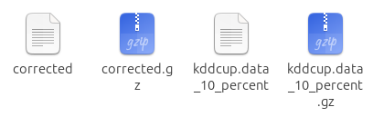
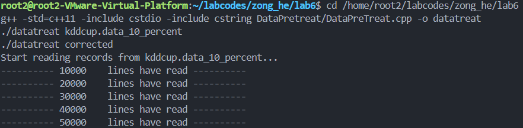
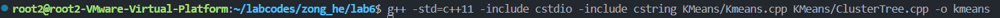
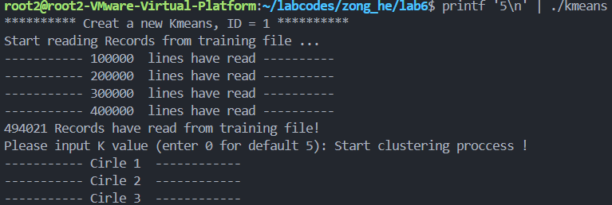
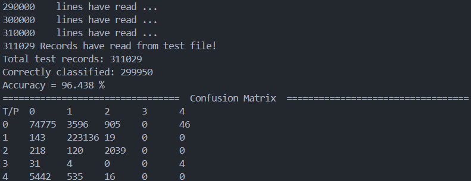

# 信息安全综合实验六：简单入侵检测模型的设计与实现
## 一、 实验目的

1. 掌握 K-Means 聚类算法的基本原理及处理流程。
2. 掌握 C++ 多文件工程的编译与执行流程。
3. 能够使用 K-Means 算法对真实网络流量入侵检测数据集（`KDDCUP99`）进行数据预处理和聚类分析，并评估模型准确率。

## 二、 实验环境

- **操作系统**：Ubuntu 
- **编译工具**：`g++` (支持 C++11 标准)
- **实验数据集**：`kddcup.data_10_percent.gz` (训练集)，`corrected.gz` (测试集)
- **实验代码目录**：`~/labcodes/zong_he/lab6`

## 三、 实验步骤

### 数据集下载
我们到https://www.kaggle.com/datasets/galaxyh/kdd-cup-1999-data?resource=download下载数据集
我们选择这两个数据集：`kddcup.data_10_percent.gz` 和 `corrected.gz`，并将它们放置在实验根目录下。


### 数据解压

初始数据集为 `gz.zip` 压缩格式，且数据预处理程序需读取纯文本的 CSV 数据格式。在终端中进入实验根目录，首先将其解压：


### 数据预处理
因为我们下载的实验代码文件里面和演示视频有些不一样，没有makefile文件，所以我们需要手动编译数据预处理程序。
K-Means 无法直接处理包含字符型标识符的原始数据，因此需要使用 `DataPretreat` 模块将字符特征转换为数值特征并提取核心维度。

编译并执行数据预处理程序：
```bash
g++ -std-c++11 -include cstdio -include cstring DataPretreat/DataPreTreat.cpp -o datatreat
./datatreat kddcup.data_10_percent
./datatreat corrected
```
目录下会成功生成 `kddcup.data_10_percent_datatreat` 和 `corrected_datatreat` 两个预处理后的文件。



### K-Means 模型的编译与运行

预处理完成后，编译 KMeans 的核心算法代码。由于有多个源文件（`Kmeans.cpp` 和 `ClusterTree.cpp`），需要一起参与编译：
```bash
g++ - std=c++11 -include cstdio -include cstring KMeans/Kmeans.cpp KMeans/ClusterTree.cpp -o kmeans
```


然后启动生成的 `kmeans` 可执行文件：
```bash
printf '5\n |./kmeans
```

程序启动后，会提示输入 K 值（`Please input K value (enter 0 for default 5):`），在此处手动输入 `5` 并按下回车。程序将开始进行聚类迭代中心的计算，迭代完成后会自动利用测试集进行预测，并输出混合矩阵及准确率。

## 四、 实验结果与分析

程序运行结束后，在终端最后打印出了混淆矩阵（Confusion Matrix）以及模型的聚类准确率，同时结果也持久化保存到了同目录下的 `Log.txt` 和 `Result.txt` 中。

**实验测得结果如下：**

- **Total test records（测试总记录数）**: `311,029`
- **Accuracy（预测准确率）**: `96.438 %`



**实验结论：**

通过基于 K-Means 的聚类算法，将网络连接记录通过预处理并计算欧氏距离分类，系统能够在默认 `K=5` 聚类簇的情况下将测试集样本有效划分，分类准确率超过 **96%**。这证明此套聚类分析系统对 KDDCUP99 入侵检测数据集具有较好的识别效果，实验圆满成功。

## main（）函数
```cpp

int main()
{		
	int Kvalue;                                        //K值
	int iRightRcdNum;                                  //记录分类正确的记录数
	int TestRcdNum;                                    //参加检测的记录总数
	string strTrueLabel,strPreLabel;                   //真实标签与预测标签
	
	strMyRecord* pRecord;                              //遍历记录的指针
	list <strMyRecord*>* pTestRcdList;                 //测试数据链表
	list<strMyRecord*>::iterator TestListIter;         //记录链表的迭代器

	ClusterNode* pClusterNode;	                     //聚类节点指针
	ClusterTree* pClusterTree;                         //聚类树
	
	/*************************************************************************************
	*********** PART1 利用K-Means算法，对训练数据集进行迭代聚类，并创建聚类树 ************
	*************************************************************************************/
	
	pClusterTree = new ClusterTree();
	// 创建 KMeans 对象，初始 level 设为 1，维度数为 19（包含 label 字段）
	CKMeans* pKMeans = new CKMeans(pClusterTree, ++KmeansID, 1, 19);

	// 读取训练数据
	if(!pKMeans->ReadTrainingRecords())
	{
		cout<<"Read training records failed!"<<endl;
		return -1;
	}

	// 用户输入 K 值（若输入无效或为非正数，则使用默认 K=5）
	cout<<"Please input K value (enter 0 for default 5): ";
	if(!(cin>>Kvalue))
	{
		// 输入失败，清理输入流并使用默认
		cin.clear();
		cin.ignore(10000,'\n');
		Kvalue = 5;
	}
	if(Kvalue <= 0)
		Kvalue = 5;

	outfile<<"Set K = "<<Kvalue<<endl;

	// 运行 KMeans 算法
	pKMeans->RunKMeans(Kvalue);

	// 打印聚类树到屏幕与日志
	pClusterTree->Print();
	pClusterTree->PrintLog();


	/****************************************************************************************
	******* PART2 利用聚类树 对测试数据集中的数据进行类型预测，并计算出准确率和混淆矩阵******
	****************************************************************************************/  

	pTestRcdList = new list<strMyRecord*>();
	if(!ReadTestFile(pTestRcdList))
	{
		cout<<"Read test records failed!"<<endl;
		return -1;
	}

	ConfuseMatrix cm; // 创建混淆矩阵
	iRightRcdNum = 0; // 预测正确的记录数
	TestRcdNum = 0;   // 参加检测的记录总数

	// 遍历测试数据链表，为每个样本找到最近的聚类中心并统计
	for(TestListIter = pTestRcdList->begin(); TestListIter != pTestRcdList->end(); ++TestListIter)
	{
		pRecord = (*TestListIter);
		// 在聚类树中找到最近的聚类节点
		pClusterNode = pClusterTree->FindNearestCluster(pRecord);
		int iPreLabel = pClusterNode->GetClusterNodeLabel();
		int iTrueLabel = pRecord->iLabel;

		if(iPreLabel == iTrueLabel)
			iRightRcdNum++;

		// 更新混淆矩阵（真实标签, 预测标签）
		cm.UpdateValue(iTrueLabel, iPreLabel);

		// 将分类记录写到 Result.txt
		Rstfile<<LabelInttoStr(iTrueLabel)<<"\t"<<LabelInttoStr(iPreLabel)<<endl;

		TestRcdNum++;
	}

	// 打印结果与计算准确率
	cout<<"Total test records: "<<TestRcdNum<<endl;
	cout<<"Correctly classified: "<<iRightRcdNum<<endl;
	double accuracy = 0.0;
	if(TestRcdNum > 0)
		accuracy = (double)iRightRcdNum / (double)TestRcdNum * 100.0;
	cout<<"Accuracy = "<<accuracy<<" %"<<endl;
	outfile<<"Accuracy = "<<accuracy<<" %"<<endl;

	// 打印并记录混淆矩阵
	cm.PrintMatrix();
	cm.PrintMatrixToLog();

	return 0;
}
```